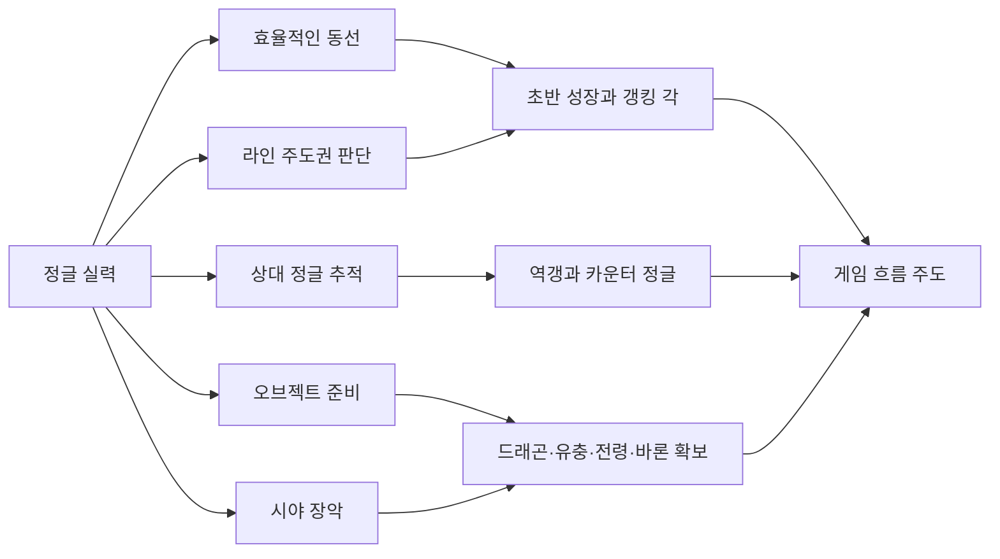
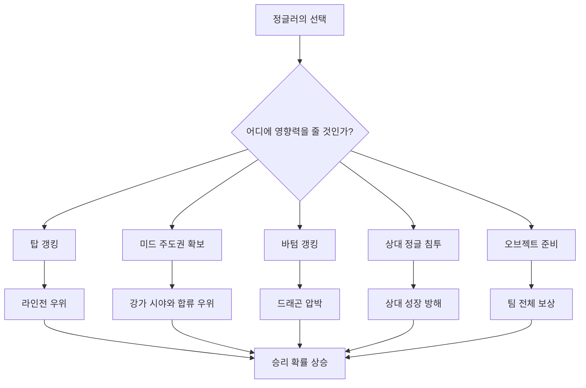
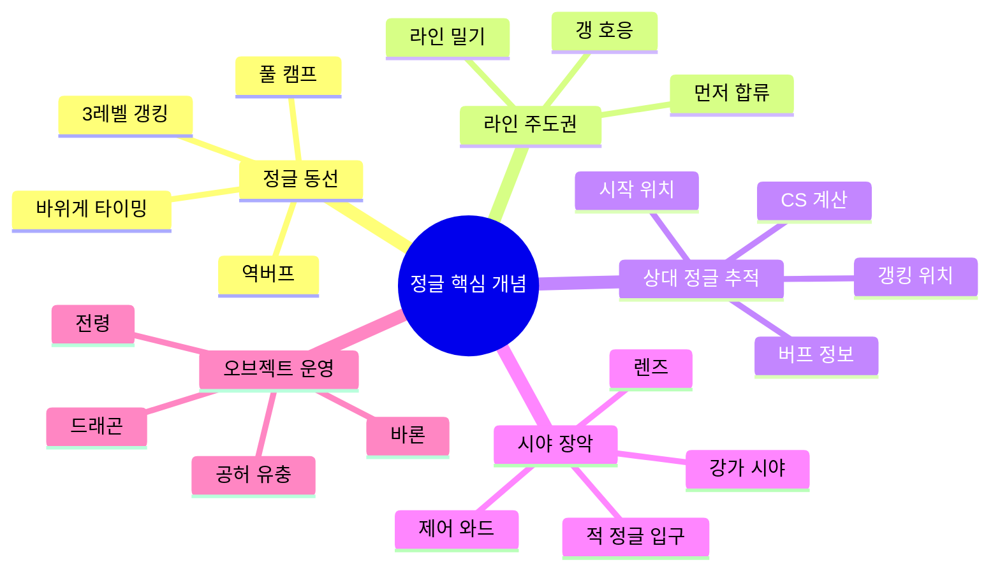
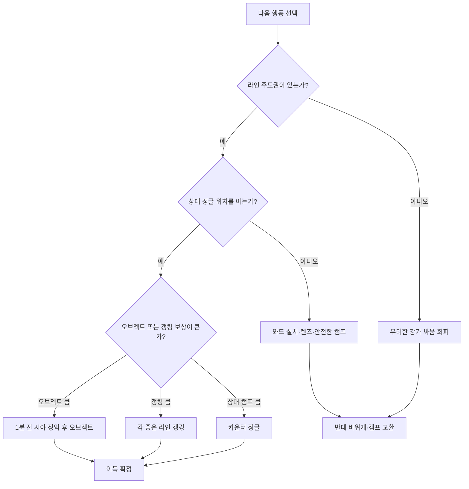
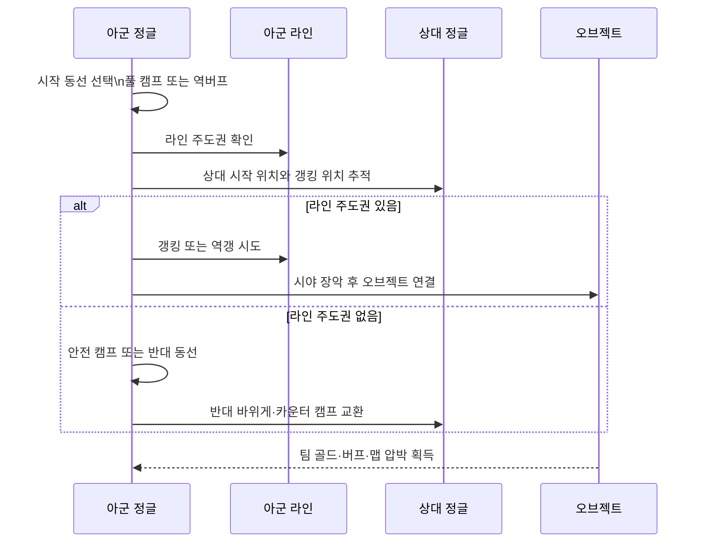
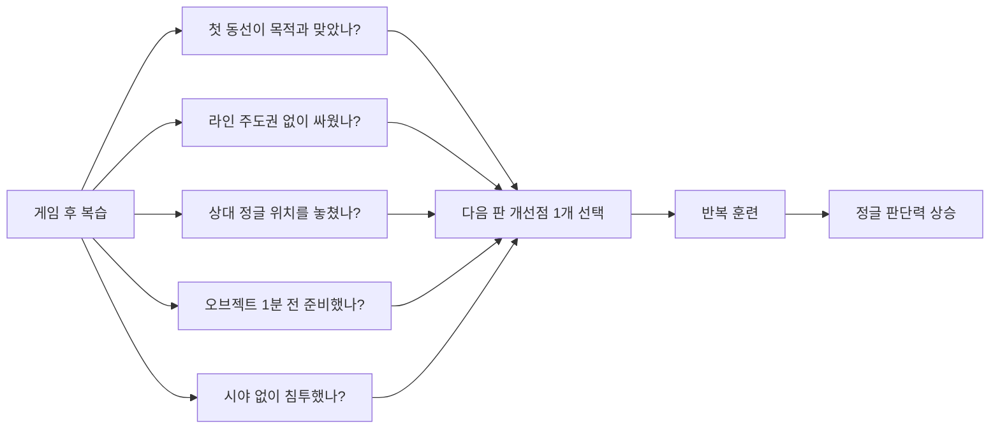

# 리그오브레전드 정글 잘하는 방법

[[정글러|정글]]을 잘하려면 캠프를 빠르게 도는 것보다 [[정글 동선|동선]] 설계, [[라인 주도권]] 확인, [[상대 정글 추적]], 오브젝트 타이밍 준비, [[시야 장악]], 리플레이 피드백을 하나의 의사결정 루프로 연결해야 한다.

## 선수 지식

- 리그오브레전드 기본 조작과 챔피언 스킬 이해
- [[정글러|정글]] 몬스터, [[강타]], 와드, 핑 사[[드래곤|용]]법
- 탑·미드·바텀 라인의 기본 역할 이해
- [[드래곤]], [[공허 유충]], 전령, [[바론]] 등 주요 오브젝트의 의미 이해
- 미니맵을 주기적으로 보는 습관

## 1. 한 줄 요약

[[정글러]]는 단순히 몬스터를 사냥하는 포지션이 아니라, 초반 [[정글 동선|동선]]으로 성장과 [[갱킹]] 각을 만들고, [[라인 주도권]]과 시야를 바탕으로 오브젝트를 준비하며, 상대 정글의 위치를 추적해 팀 전체의 흐름을 설계하는 포지션이다. 잘하는 정글러는 '지금 캠프를 먹을지, 갱을 갈지, 역갱을 볼지, 오브젝트를 칠지, 카운터 정글을 할지'를 매 순간 비교한다. 따라서 핵심은 빠른 손보다 좋은 판단 루틴이다.



1. **정글러의 역할을 한 문장으로 정의하기**: [[정글러|정글]]이 캠프 사냥이 아니라 맵 전체의 의사결정 포지션임을 이해한다.
2. **판단 루프 만들기**: 캠프, [[갱킹]], 역갱, 오브젝트, 시야 중 무엇을 우선할지 비교하는 습관을 만든다.

## 2. 왜 중요한가

정글은 라인에 고정되지 않기 때문에 전 라인에 영향을 줄 수 있다. [[갱킹]]으로 라인전을 돕고, [[드래곤]]·[[공허 유충]]·전령·[[바론]] 같은 오브젝트를 관리하며, 와드와 [[정글 동선|동선]] 예측으로 상대 정글을 압박한다. 특히 초반 몇 분의 동선은 [[바위게]] 교전, 첫 갱킹, 첫 오브젝트 준비로 이어지므로 게임 전체의 템포를 결정한다. 출처 자료에서도 [[정글러]]를 게임의 흐름을 주도하는 포지션, 혹은 팀의 두뇌 역할로 설명하며, 초반 빌드업과 [[오브젝트 컨트롤]]의 중요성을 강조한다.



1. **정글 영향력의 범위 이해**: [[정글러]]가 한 라인이 아니라 전장 전체의 균형을 바꿀 수 있음을 이해한다.
2. **초반 5분의 중요성**: 초반 [[정글 동선|동선]]이 [[바위게]], [[갱킹]], 오브젝트 준비로 연결되는 구조를 파악한다.

## 3. 핵심 개념

[[정글러|정글]]을 배우는 첫 단계는 핵심 용어를 의사결정 언어로 바꾸는 것이다. [[정글 동선]]은 어떤 캠프를 어떤 순서로 돌며 어느 라인에 도착할지 설계하는 것이다. [[라인 주도권]]은 아군 라이너가 먼저 움직일 수 있는 상태인지 판단하는 기준이다. [[상대 정글 추적]]은 시작 위치, CS, 버프, [[갱킹]] 위치를 보고 다음 위치를 예측하는 기술이다. [[시야 장악]]은 와드와 렌즈로 안전한 움직임과 오브젝트 준비를 만드는 과정이다. [[오브젝트 컨트롤|오브젝트 운영]]은 [[드래곤]], [[공허 유충]], 전령, [[바론]]이 나오기 전에 캠프와 라인, 시야를 미리 맞추는 것이다.



1. **정글 용어를 판단 기준으로 바꾸기**: [[정글 동선|동선]], [[라인 주도권|주도권]], 시야, 오브젝트를 실제 게임 중 체크리스트로 사[[드래곤|용]]할 수 있다.
2. **상대 정글 추적의 기본**: 상대 시작 위치와 등장 위치를 바탕으로 다음 행동을 예측한다.

## 4. 아키텍처 또는 흐름

[[정글러|정글]] 운영은 게임 시간대별로 목표가 달라진다. 0분부터 첫 캠프 전까지는 시작 위치와 와드 정보를 정한다. 1~3분대에는 선택한 [[정글 동선|동선]]에 따라 3레벨 [[갱킹]], 풀 캠프, 역버프 기습 중 하나를 수행한다. [[바위게]] 타이밍에는 [[라인 주도권]]과 챔피언 교전력을 보고 싸울지, 반대 바위게로 돌릴지 결정한다. 5~6분 전후에는 [[공허 유충]]과 [[드래곤|첫 드래곤]] 같은 오브젝트를 준비하기 위해 1분 전부터 캠프 방향, 귀환, 시야, 라인 합류 가능성을 맞춘다. 중후반에는 [[바론]], 드래곤 영혼, 장로 드래곤 같은 큰 오브젝트를 중심으로 시야를 잡고 한타 또는 스틸 가능성을 관리한다.

```mermaid
timeline
    title 정글 운영 시간 흐름
    00:00 : 시작 위치 결정, 인베이드·방어 와드, 상대 리쉬 정보 확인
    01:30 : 첫 캠프 시작, 강타와 체력 관리
    02:30 : 3레벨 갱킹 또는 풀 캠프 지속 여부 판단
    03:30 : 바위게 생성, 라인 주도권과 교전력 확인
    05:00 : 공허 유충 준비, 위쪽 시야와 합류 체크
    06:00 : 첫 드래곤 준비, 아래쪽 시야와 바텀·미드 주도권 체크
    08:00+ : 전령·타워 골드·카운터 정글 기회 탐색
    20:00+ : 바론 중심 시야 장악, 한타·스틸·턴 판단
```

1. **초반 동선 설계**: 챔피언 성향에 따라 풀 캠프, 3레벨 [[갱킹]], 역버프 [[정글 동선|동선]]을 선택한다.
2. **오브젝트 1분 전 준비**: 오브젝트가 나온 뒤 움직이는 것이 아니라 나오기 전에 캠프와 시야를 맞춘다.

## 5. 중요한 세부사항, edge case, tradeoff

[[정글러|정글]]에서 가장 중요한 차이는 '무조건 정답 [[정글 동선|동선]]'이 아니라 상황별 전환 능력이다. [[바위게]]가 중요하더라도 아군 라인이 밀리고 있고 상대 정글이 더 강하면 싸움을 피하고 반대쪽으로 돌리는 것이 낫다. 풀 캠프가 성장에는 좋지만, 아군 라인이 큰 딜교환을 했거나 상대가 다이브 각을 만들면 캠프를 포기하고 백업하는 판단이 더 큰 이득일 수 있다. [[갱킹]]을 많이 가면 라인을 도울 수 있지만 실패하면 캠프 손실과 레벨 차이가 생긴다. 카운터 정글은 상대 성장을 막지만, [[라인 주도권]]과 시야 없이 들어가면 죽어서 게임을 망칠 수 있다. 오브젝트도 마찬가지로, [[드래곤]] 자체보다 그 전에 미드·바텀 주도권, 체력, [[강타]], 시야, 상대 위치를 맞추는 과정이 더 중요하다.



1. **싸워야 할 바위게와 버려야 할 바위게 구분**: [[라인 주도권]]과 챔피언 교전력에 따라 [[바위게]] 싸움 여부를 판단한다.
2. **캠프 포기와 백업의 기준**: 개인 성장과 팀 교전 이득 사이의 tradeoff를 비교한다.
3. **카운터 정글의 위험 관리**: 상대 위치, [[라인 주도권]], 시야가 없을 때 침투하지 않는 원칙을 세운다.

## 6. 실전 예시

예시 1: 성장형 [[정글러]]라면 첫 [[정글 동선|동선]]을 풀 캠프로 잡고, 3분 30초 [[바위게]]에 맞춰 캠프를 끝내는 것을 목표로 한다. 하지만 미드와 바텀이 밀리고 상대 정글이 초반 교전형이면 같은 바위게에서 싸우지 말고 반대 바위게를 먹거나 귀환 후 다음 캠프 재생성에 맞춘다. 예시 2: [[갱킹]]형 정글러라면 역버프 시작으로 상대 예측을 흔들고, 3레벨에 시야가 부족한 라인을 찌른다. 이때 갱킹 성공만 보지 말고, 갱 이후 드래곤이나 [[공허 유충]]으로 이어질 수 있는지까지 본다. 예시 3: 5분 전후 공허 유충을 노린다면 4분대부터 아래 캠프를 정리하고 위쪽으로 올라가며 탑·미드 라인 상태와 시야를 맞춘다. 반대로 [[드래곤|첫 드래곤]]을 노린다면 바텀·미드 [[라인 주도권|주도권]], 강가 제어 와드, 상대 정글 위치를 먼저 확인한다.



1. **성장형 정글러 운영 예시**: 풀 캠프와 [[바위게]] 타이밍을 연결하되 불리한 교전은 피한다.
2. **갱킹형 정글러 운영 예시**: 역버프와 3레벨 [[갱킹]]으로 상대 예측을 흔드는 방법을 익힌다.
3. **오브젝트 준비 예시**: 오브젝트 1분 전부터 캠프 방향, 시야, [[라인 주도권]]을 맞춘다.

## 7. 용어집 또는 빠른 복습

빠른 복습: [[정글 동선]]은 첫 5분의 계획이고, [[라인 주도권]]은 내가 강가에서 싸워도 되는지의 허가증이다. [[상대 정글 추적]]은 역갱과 카운터 정글의 출발점이며, [[시야 장악]]은 오브젝트를 안전하게 먹기 위한 준비다. [[오브젝트 컨트롤|오브젝트 운영]]은 생성 시간에 맞춰 움직이는 것이 아니라 생성 1분 전부터 캠프, 귀환, 시야, 라인 합류를 맞추는 과정이다. 좋은 [[정글러]]는 팀원의 모든 요청에 끌려다니지 않고, 가장 큰 기대값을 주는 행동을 선택한다. 실력 향상을 위해서는 매판 리플레이에서 첫 동선, 첫 [[갱킹]] 판단, 첫 오브젝트 준비, 죽은 위치, 놓친 상대 정글 정보를 체크한다.



1. **정글 핵심 용어 복습**: [[정글 동선|동선]], [[라인 주도권|주도권]], 추적, 시야, 오브젝트를 한 번에 정리한다.
2. **리플레이 피드백 루틴**: 판수만 늘리는 것이 아니라 매판 하나의 판단 오류를 고친다.

## 참고 링크

- [2025년 롤 정글 공략 – 맵 장악력을 극대화하는 정글 운영법](https://smart-guy.tistory.com/entry/2025년-롤-정글-공략-–-맵-장악력을-극대화하는-정글-운영법)
- [정글 동선 루트 최신판 LoL 가이드](https://무현팀.com/guides/jungle-pathing)
