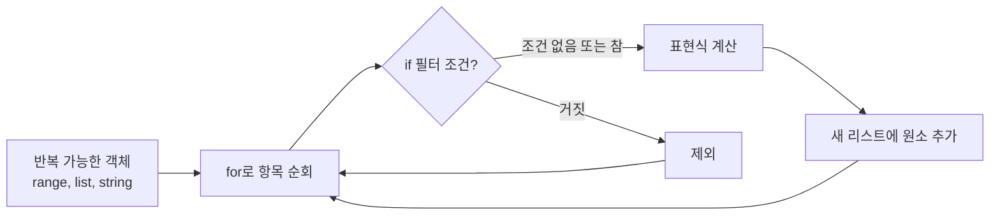
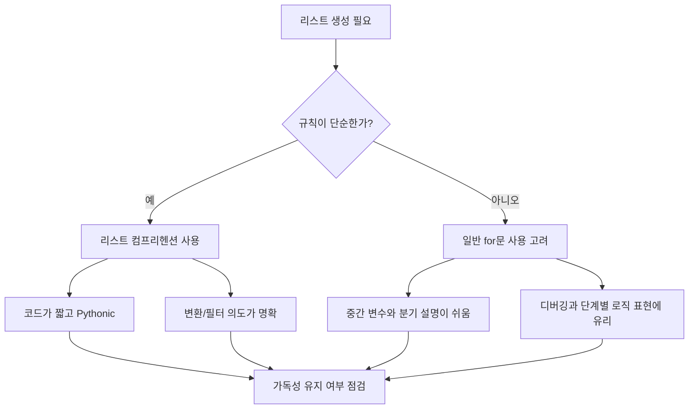
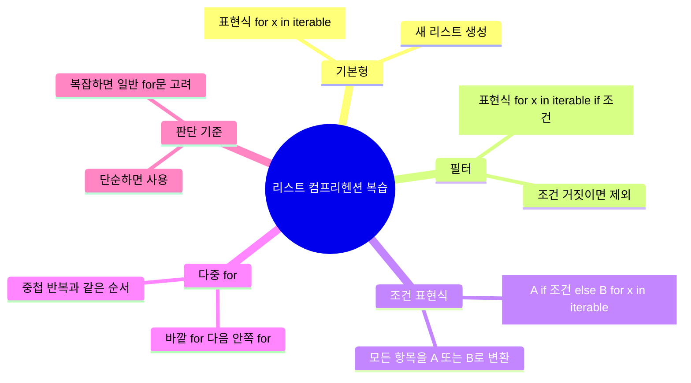

# 파이썬 리스트 컴프리헨션

[[리스트 컴프리헨션|파이썬 리스트 컴프리헨션]]은 반복문과 조건문을 한 줄 [[표현식]]으로 결합해 새 리스트를 간결하고 [[Pythonic]]하게 만드는 문법이다.

## 선수 지식

- 파이썬 리스트 기본 사용법
- [[for 절|for 반복문]]
- [[if 필터|if 조건]]문
- range() 함수
- 함수 호출과 [[표현식]]의 차이

## 한 줄 요약

[[리스트 컴프리헨션]]은 기존의 `for` 반복문, `if` 조건문, `append()` 호출로 작성하던 리스트 생성 과정을 `[표현식 for 항목 in 반복가능객체 if 조건]` 형태로 압축하는 문법이다. 예를 들어 1부터 10까지의 짝수 리스트는 일반 반복문으로 여러 줄에 걸쳐 만들 수 있지만, 리스트 컴프리헨션을 사용하면 `[x for x in range(1, 11) if x % 2 == 0]` 한 줄로 만들 수 있다. 핵심은 '반복해서 값을 꺼내고, 필요하면 걸러낸 뒤, 최종 원소로 변환해 리스트에 담는다'는 흐름이다.



1. **리스트 컴프리헨션의 목적 이해**: 반복문과 append()를 사용하는 리스트 생성 코드를 컴프리헨션으로 바꿀 수 있다.
2. **기본 문법 읽기**: `[표현식 for 변수 in 반복가능객체]` 구조에서 각 부분의 역할을 설명할 수 있다.

## 왜 중요한가

[[리스트 컴프리헨션]]은 파이썬에서 매우 자주 쓰이는 관용적 문법이다. 같은 결과를 만드는 코드라도 일반 반복문보다 짧고, '어떤 값을 어떤 규칙으로 새 리스트에 담는지'를 한눈에 드러낼 수 있다. 예를 들어 빈 리스트를 만들고, 반복하고, 조건을 검사하고, `append()`하는 절차적 코드는 단계가 많다. 반면 리스트 컴프리헨션은 결과 리스트의 생성 규칙을 한 줄로 표현한다. 다만 무조건 짧게 쓰는 것이 좋은 것은 아니다. 조건이 너무 많거나 중첩 반복문이 지나치게 복잡하면 오히려 읽기 어려워질 수 있으므로, 간결함과 가독성 사이의 균형이 중요하다.



1. **Pythonic 코드의 의미**: [[리스트 컴프리헨션]]이 [[Pythonic|파이썬다운 코드]]로 여겨지는 이유를 설명할 수 있다.
2. **간결함과 가독성의 균형**: [[리스트 컴프리헨션]]을 써야 할 상황과 일반 반복문이 더 나은 상황을 구분할 수 있다.

## 핵심 개념

[[리스트 컴프리헨션]]의 기본형은 `[생성될 원소 for 반복변수 in 반복가능객체]`이다. 여기서 맨 앞의 `생성될 원소`는 최종 리스트에 들어갈 값이며, 단순 변수일 수도 있고 `x * 2`, `x ** 2`, `함수(x)` 같은 표현식일 수도 있다. 뒤쪽의 `for 반복변수 in 반복가능객체`는 값을 하나씩 꺼내는 부분이다. 여기에 필터링 조건을 붙이면 `[생성될 원소 for 반복변수 in 반복가능객체 if 조건]`이 된다. 이때 뒤쪽의 `if`는 원소를 포함할지 제외할지를 결정하는 필터 역할을 한다. 반면 `if-else`로 값을 선택하고 싶을 때는 `[참일때값 if 조건 else 거짓일때값 for 반복변수 in 반복가능객체]`처럼 표현식 위치에 조건식을 써야 한다.

```mermaid
flowchart LR
    A[리스트 컴프리헨션] --> B[표현식<br/>생성될 원소]
    A --> C[for 절<br/>반복 변수와 반복 가능 객체]
    A --> D[선택적 if 필터<br/>원소 포함 여부 결정]
    A --> E[조건 표현식 if-else<br/>원소 값 선택]
    B --> B1[x, x*2, x**2, 함수(x)]
    C --> C1[for x in range(1, 11)]
    D --> D1[if x % 2 == 0]
    E --> E1[1 if x % 2 == 0 else 0]
```

1. **기본형과 필터형 구분**: `if`가 뒤에 오는 필터형과 앞에 오는 `if-else` [[조건 표현식]]을 구분할 수 있다.
2. **표현식 위치 이해**: 최종 리스트에 담기는 값이 컴프리헨션 맨 앞 [[표현식]]에서 결정됨을 이해한다.

## 아키텍처 또는 흐름

[[리스트 컴프리헨션]]은 내부적으로 일반 반복문과 비슷한 흐름으로 이해할 수 있다. 예를 들어 `[x for x in range(1, 11) if x % 2 == 0]`은 빈 리스트를 만들고, `range(1, 11)`에서 숫자를 하나씩 꺼낸 뒤, 짝수인지 검사하고, 조건을 만족하면 리스트에 추가하는 과정과 같다. 다중 `for`문을 사용할 수도 있다. 이때 작성 순서는 일반 중첩 반복문과 동일하게 바깥 반복문을 먼저, 안쪽 반복문을 나중에 쓴다. 예를 들어 `[x * y for x in range(2, 5) for y in range(1, 10)]`은 2단, 3단, 4단의 곱셈 결과를 차례대로 만든다.

```mermaid
flowchart TD
    A[컴프리헨션 시작] --> B[바깥 for 실행<br/>예: x in range(2,5)]
    B --> C[안쪽 for 실행<br/>예: y in range(1,10)]
    C --> D{필터 조건이 있는가?}
    D -- 없음 --> E[표현식 계산<br/>예: x * y]
    D -- 있음 --> F{조건이 참인가?}
    F -- 참 --> E
    F -- 거짓 --> C
    E --> G[결과 리스트에 추가]
    G --> C
    C --> H{안쪽 반복 끝?}
    H -- 아니오 --> C
    H -- 예 --> I{바깥 반복 끝?}
    I -- 아니오 --> B
    I -- 예 --> J[완성된 리스트 반환]
```

1. **일반 반복문으로 풀어 읽기**: [[리스트 컴프리헨션]]을 동등한 for문과 append() 코드로 변환해 이해할 수 있다.
2. **다중 for문의 실행 순서**: 컴프리헨션에서 여러 for문이 왼쪽에서 오른쪽 순서로 중첩 실행됨을 설명할 수 있다.

## 중요한 세부사항, edge case, tradeoff

[[리스트 컴프리헨션]]에서 가장 헷갈리는 부분은 `if`의 위치다. 뒤쪽의 `if`는 필터이므로 조건을 만족하지 않는 원소는 아예 리스트에 들어가지 않는다. 반면 `A [[if 필터|if 조건]] else B`는 [[조건 표현식]]이므로 모든 반복 항목에 대해 하나의 값을 선택해 리스트에 넣는다. 또한 리스트 컴프리헨션에는 별도의 `elif` 문법이 없다. 여러 조건을 나누고 싶다면 중첩 조건 표현식을 사용할 수 있지만, 조건이 길어지면 읽기 어려워진다. 다중 `for`문과 조건문을 계속 추가할 수도 있지만, 복잡도가 높아지면 일반 반복문으로 풀어 쓰는 편이 유지보수에 좋다. 즉, 리스트 컴프리헨션은 '짧게 쓸 수 있는 문법'이 아니라 '짧게 써도 명확한 경우에 쓰는 문법'으로 이해해야 한다.

```mermaid
flowchart TD
    A[리스트 컴프리헨션 설계] --> B{조건의 목적은?}
    B -- 원소를 걸러내기 --> C[뒤쪽 if 사용<br/>[expr for x in xs if cond]]
    B -- 원소 값을 선택하기 --> D[앞쪽 조건 표현식 사용<br/>[A if cond else B for x in xs]]
    C --> E{조건이 여러 개인가?}
    D --> E
    E -- 단순 --> F[컴프리헨션 유지]
    E -- 복잡/중첩 많음 --> G[일반 for문으로 전환]
    F --> H[간결성과 가독성 확보]
    G --> I[디버깅과 유지보수성 확보]
```

1. **필터 if와 조건 표현식 구분**: `[x for x in xs [[if 필터|if 조건]]]`과 `[A if 조건 else B for x in xs]`의 결과 차이를 예측할 수 있다.
2. **복잡도 기준 세우기**: 중첩 조건과 다중 반복이 많을 때 일반 반복문으로 바꾸는 판단 기준을 세울 수 있다.

## 실전 예시

첫 번째 예시는 짝수만 뽑기다. `[x for x in range(1, 11) if x % 2 == 0]`은 `[2, 4, 6, 8, 10]`을 만든다. 두 번째 예시는 값 변환이다. `[x ** 2 for x in range(1, 16)]`은 1부터 15까지의 제곱수를 만든다. 세 번째 예시는 조건에 따라 값을 바꾸는 경우다. `[1 if x % 2 == 0 else 0 for x in range(1, 6)]`은 짝수는 1, 홀수는 0으로 바꾸어 `[0, 1, 0, 1, 0]`을 만든다. 네 번째 예시는 다중 반복이다. `[x * y for x in range(2, 5) for y in range(1, 10)]`은 2단부터 4단까지의 구구단 결과를 순서대로 만든다. 마지막으로 사용자 정의 함수를 적용할 수도 있다. 예를 들어 `add_ab(x)` 같은 함수를 만든 뒤 `[add_ab(x) for x in 'airplane']`처럼 문자열의 각 문자를 순회하며 변환할 수 있다.

```mermaid
flowchart LR
    A[실전 패턴] --> B[필터링<br/>짝수만 선택]
    A --> C[매핑<br/>제곱/곱셈 적용]
    A --> D[조건 변환<br/>짝수면 1, 홀수면 0]
    A --> E[중첩 반복<br/>구구단/좌표쌍]
    A --> F[함수 적용<br/>사용자 정의 함수 호출]
    B --> B1[[x for x in range(1,11) if x%2==0]]
    C --> C1[[x**2 for x in range(1,16)]]
    D --> D1[[1 if x%2==0 else 0 for x in range(1,6)]]
    E --> E1[[x*y for x in range(2,5) for y in range(1,10)]]
    F --> F1[[add_ab(x) for x in 'airplane']]
```

1. **대표 패턴 연습**: 필터링, 변환, 조건 변환, 중첩 반복, 함수 적용 패턴을 각각 작성할 수 있다.
2. **문자열과 리스트 순회**: 리스트뿐 아니라 문자열 같은 [[반복 가능한 객체]]에도 컴프리헨션을 적용할 수 있음을 이해한다.

## 용어집 또는 빠른 복습

[[리스트 컴프리헨션]]은 새 리스트를 만드는 [[표현식]]이다. `표현식`은 최종 원소를 계산하는 부분이고, `[[for 절]]`은 [[반복 가능한 객체]]에서 값을 하나씩 꺼내는 부분이다. `[[if 필터]]`는 조건에 맞는 항목만 포함시키는 역할을 하며, `[[조건 표현식]]`은 조건에 따라 서로 다른 값을 선택하는 역할을 한다. `[[다중 for문]]`은 중첩 반복을 한 줄로 표현하는 방식이고, 작성 순서는 일반 중첩 반복문과 같다. 빠르게 복습하려면 다음 질문에 답해보면 된다. 첫째, 이 컴프리헨션의 최종 원소는 무엇인가? 둘째, 어떤 객체를 반복하는가? 셋째, 어떤 항목을 제외하는가? 넷째, 조건에 따라 값이 바뀌는가? 다섯째, 너무 복잡해서 일반 반복문이 더 낫지는 않은가?



1. **핵심 용어 정리**: [[표현식]], [[for 절]], [[if 필터]], [[조건 표현식]], [[다중 for문]]의 의미를 설명할 수 있다.
2. **자기 점검 질문**: 컴프리헨션을 읽을 때 원소, 반복 대상, 필터, 변환 조건을 순서대로 파악할 수 있다.

## 참고 링크

- [[파이썬/Python]리스트 컴프리헨션 이해하기 + 구조 및 예제](https://mid-night-coding.tistory.com/entry/파이썬Python리스트-컴프리헨션-이해하기-구조-및-예제)
- [파이썬 리스트 컴프리헨션(List Comprehension) 예제 총정리](https://jimmy-ai.tistory.com/131)
