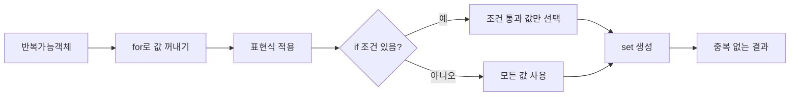
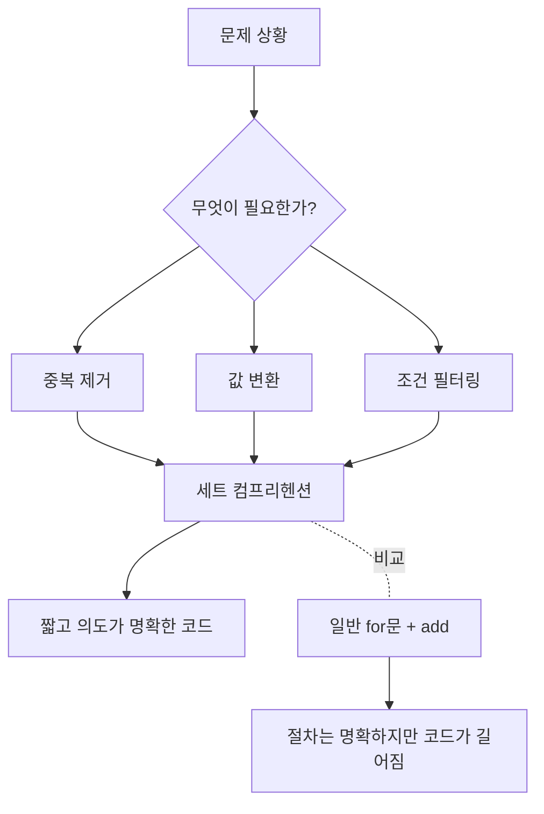
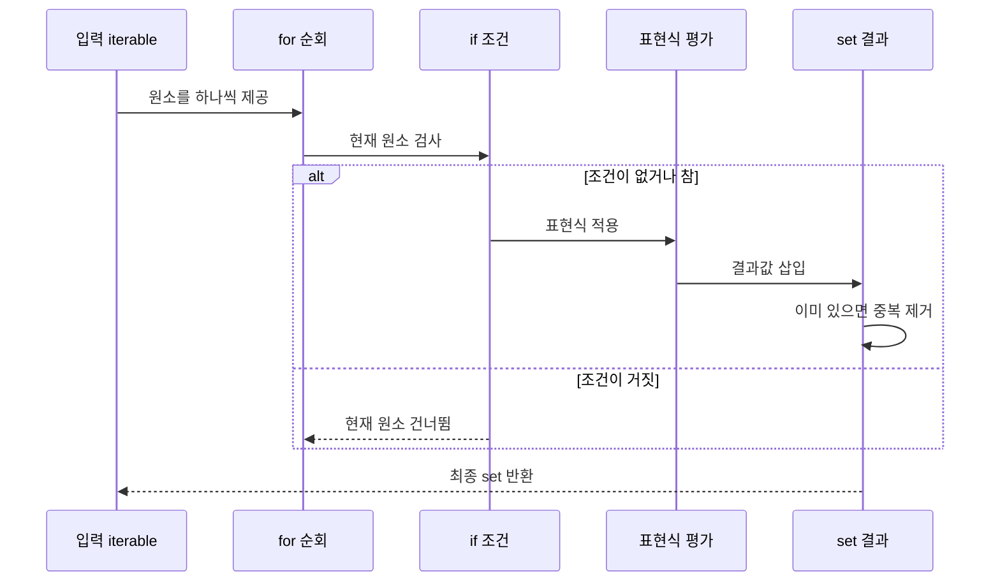

# 파이썬 세트 컴프리헨션

[[세트 컴프리헨션|파이썬 세트 컴프리헨션]]은 `{표현식 for 변수 in 반복가능객체 if 조건}` 형태로 중복 없는 `set`을 간결하게 생성하는 문법이다.

## 선수 지식

- 파이썬 기본 문법
- for 반복문
- [[조건 필터|if 조건]]문
- 반복가능객체([[반복가능객체|iterable]])의 개념
- [[set]] 자료형의 기본 성질
- [[리스트 컴프리헨션]] 기초

## 1. 한 줄 요약

[[세트 컴프리헨션]]은 반복 가능한 데이터에서 값을 꺼내 [[표현식]]으로 변환하고, 필요하면 조건으로 걸러낸 뒤, 최종 결과를 중복 없는 `set`으로 만드는 파이썬 문법이다. 기본 형태는 `{표현식 for 변수 in 반복가능객체 if 조건}`이며, [[리스트 컴프리헨션]]과 모양은 비슷하지만 결과 타입이 리스트가 아니라 [[set|세트]]라는 점이 핵심이다. 예를 들어 `{x for x in [1, 2, 2, 3]}`의 결과는 중복이 제거된 `{1, 2, 3}`이다.



1. **세트 컴프리헨션의 한 문장 정의**: [[세트 컴프리헨션]]이 무엇을 만들고 어떤 상황에서 쓰이는지 설명할 수 있다.
2. **기본 형태 빠르게 읽기**: `{표현식 for 변수 in 반복가능객체 if 조건}` 구조를 왼쪽부터 해석할 수 있다.

## 2. 왜 중요한가

[[세트 컴프리헨션]]은 중복 제거와 데이터 변환을 한 줄에 함께 표현할 수 있어 코드의 의도를 분명하게 만든다. 일반적인 `for` 반복문으로는 빈 [[set|세트]]를 만들고 `add()`를 반복 호출해야 하지만, 세트 컴프리헨션을 사용하면 “이 데이터에서 고유한 값만 모으겠다”는 의도가 코드에 직접 드러난다. 특히 단어를 소문자로 통일하면서 중복을 제거하거나, 문자열에서 고유 문자만 추출하거나, 계산 결과로 가능한 값의 종류를 파악할 때 유용하다.



1. **반복문 방식과 비교하기**: `set()` 생성 후 `add()`를 호출하는 방식과 [[세트 컴프리헨션]]의 차이를 이해한다.
2. **중복 제거 의도 표현하기**: [[세트 컴프리헨션]]이 데이터 정제 코드에서 왜 읽기 쉬운지 설명할 수 있다.

## 3. 핵심 개념

[[세트 컴프리헨션]]의 핵심은 세 가지다. 첫째, 중괄호 `{}` 안에 단일 [[표현식]]을 쓴다. 둘째, `for 변수 in 반복가능객체`로 값을 순회한다. [[set|셋]]째, 선택적으로 `if 조건`을 붙여 원하는 값만 남긴다. 이때 `{v for ...}`처럼 콜론이 없으면 세트 컴프리헨션이고, `{k: v for ...}`처럼 콜론이 있으면 [[딕셔너리 컴프리헨션]]이다. 또한 세트는 중복을 허용하지 않고 순서가 보장되지 않는 자료형이므로, 결과를 출력했을 때 입력 순서와 다르게 보일 수 있다.

```mermaid
flowchart LR
    A[중괄호 사용] --> B{안에 콜론 ':' 이 있는가?}
    B -- 아니오 --> C[세트 컴프리헨션]
    C --> C1[{v for v in iterable if condition}]
    C --> C2[결과: set]
    C2 --> C3[중복 없음]
    C2 --> C4[순서 보장 없음]
    B -- 예 --> D[딕셔너리 컴프리헨션]
    D --> D1[{k: v for item in iterable}]
    D --> D2[결과: dict]
```

1. **문법 구성 요소 분해하기**: [[표현식]], 변수, [[반복가능객체]], 조건의 역할을 구분할 수 있다.
2. **세트와 딕셔너리 컴프리헨션 구분하기**: 중괄호 내부의 콜론 유무로 결과 타입을 판단할 수 있다.

## 4. 아키텍처 또는 흐름

[[세트 컴프리헨션]]은 내부적으로 반복, 조건 검사, [[표현식]] 평가, [[set|세트]] 삽입의 흐름으로 이해하면 쉽다. 예를 들어 `{w.lower() for w in words}`는 `words`에서 단어를 하나씩 꺼내고, 각 단어에 `lower()`를 적용한 뒤, 결과를 세트에 넣는다. 세트에 넣는 순간 같은 값은 하나만 남기 때문에 `APPLE`과 `apple`이 모두 `apple`로 변환되면 결과에는 `apple`이 한 번만 존재한다. 조건이 있는 경우에는 조건을 통과한 값만 표현식 평가 결과로 들어간다.



1. **실행 순서 추적하기**: [[세트 컴프리헨션]]이 반복, 조건, [[표현식]], 삽입 순서로 동작함을 설명할 수 있다.
2. **변환과 중복 제거 결합하기**: `lower()` 같은 변환이 중복 제거 전에 적용된다는 점을 예제로 이해한다.

## 5. 중요한 세부사항, edge case, tradeoff

[[세트 컴프리헨션]]을 사용할 때 가장 자주 발생하는 혼동은 [[딕셔너리 컴프리헨션]]과의 구분이다. `{v for ...}`는 [[set|세트]]이고 `{k: v for ...}`는 딕셔너리다. 또 다른 중요한 점은 세트가 순서를 보장하지 않는다는 것이다. 단순히 중복을 제거하는 것이 목적이라면 세트 컴프리헨션이 적합하지만, 입력 순서를 유지하면서 중복을 제거해야 한다면 `dict.fromkeys()`를 사용해 `list(dict.fromkeys(items))`처럼 처리하는 방식이 더 적합하다. 즉, 세트 컴프리헨션은 간결하고 빠르게 고유 값 집합을 만들기 좋지만, 순서가 중요한 결과에는 맞지 않을 수 있다.

```mermaid
flowchart TD
    A[중복 제거가 필요한가?] --> B{순서 유지가 필요한가?}
    B -- 아니오 --> C[세트 컴프리헨션 사용]
    C --> C1[{x for x in items}]
    C --> C2[결과: set, 순서 보장 없음]
    B -- 예 --> D[dict.fromkeys 사용]
    D --> D1[list(dict.fromkeys(items))]
    D --> D2[결과: list, 최초 등장 순서 유지]
    A --> E{key:value 형태가 필요한가?}
    E -- 예 --> F[딕셔너리 컴프리헨션]
    E -- 아니오 --> C
```

1. **순서 보장 여부 판단하기**: [[세트 컴프리헨션]]이 순서 유지용 도구가 아님을 이해한다.
2. **적절한 중복 제거 방법 선택하기**: [[세트 컴프리헨션]]과 `dict.fromkeys()`를 상황에 맞게 선택할 수 있다.

## 6. 실전 예시

실전에서는 [[세트 컴프리헨션]]을 데이터 정제, 문자열 처리, 가능한 값의 종류 확인에 자주 사용한다. 예를 들어 `words = ['apple', 'Banana', 'APPLE', 'orange', 'banana']`에서 `{w.lower() for w in words}`를 실행하면 대소문자를 소문자로 통일하면서 `{'apple', 'banana', 'orange'}`처럼 중복을 제거할 수 있다. 문자열에서는 `{char for char in text if char not in 'abc'}`처럼 특정 문자를 제외한 고유 문자만 추출할 수 있다. 숫자 계산에서는 `{x % 3 for x in range(10)}`처럼 나머지로 가능한 값의 [[set|집합]] `{0, 1, 2}`를 빠르게 확인할 수 있다.

```mermaid
flowchart LR
    A[실전 입력] --> B{사용 목적}
    B --> C[데이터 정제]
    C --> C1[소문자 변환 + 중복 제거]
    C1 --> C2[{w.lower() for w in words}]
    B --> D[문자열 처리]
    D --> D1[조건에 맞는 고유 문자 추출]
    D1 --> D2[{char for char in text if char not in 'abc'}]
    B --> E[가능한 값 집합]
    E --> E1[계산 결과 종류 확인]
    E1 --> E2[{x % 3 for x in range(10)}]
```

1. **단어 목록 정제하기**: 문자열 변환과 중복 제거를 한 번에 수행하는 코드를 작성할 수 있다.
2. **문자열과 숫자 예제 적용하기**: 문자열 필터링과 나머지 [[set|집합]] 계산에 [[세트 컴프리헨션]]을 활용할 수 있다.

## 7. 용어집 또는 빠른 복습

빠르게 복습하면, [[세트 컴프리헨션]]은 중복 없는 [[set|집합]]을 만드는 [[표현식]]이고, 기본 구조는 `{표현식 for 변수 in 반복가능객체 if 조건}`이다. `if 조건`은 선택 사항이며, 조건이 없으면 모든 원소가 대상이 된다. `{x for x in data}`는 세트 컴프리헨션이고, `{k: v for ...}`는 [[딕셔너리 컴프리헨션]]이다. 세트는 중복을 제거하지만 순서를 보장하지 않는다. 따라서 고유 값 집합이 필요하면 세트 컴프리헨션, [[dict.fromkeys()|순서 유지 중복 제거]]가 필요하면 `dict.fromkeys()`를 떠올리면 된다.

```mermaid
mindmap
  root((세트 컴프리헨션))
    문법
      {표현식 for 변수 in 반복가능객체}
      if 조건은 선택
    결과
      set
      중복 없음
      순서 보장 없음
    비교
      리스트 컴프리헨션은 list 생성
      딕셔너리 컴프리헨션은 콜론 사용
    활용
      데이터 정제
      고유 문자 추출
      가능한 값 집합 확인
    대안
      순서 유지 필요 시 dict.fromkeys
```

1. **핵심 문법 암기하기**: [[세트 컴프리헨션]]의 기본 구조와 결과 타입을 즉시 말할 수 있다.
2. **사용 여부 빠르게 판단하기**: 중복 제거, 순서 유지, 딕셔너리 생성 요구사항에 따라 올바른 문법을 고를 수 있다.

## 참고 링크

- [[Python] 세트 컴프리헨션 (Set Comprehension)](https://rimeestore.tistory.com/entry/세트-컴프리헨션-Set-Comprehension)
- [[파이썬 기초] 셋 컴프리헨션](https://dongdongfather.tistory.com/99)
- [Just a moment... - wikidocs.net](https://wikidocs.net/327459)
