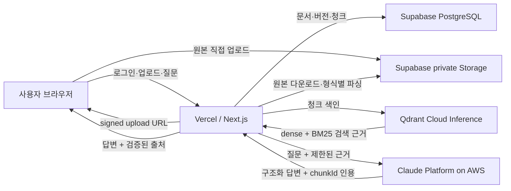

# Sageum Document Intelligence

다양한 문서를 구조화해 저장하고, 문서 근거를 검색해 답변과 출처를 함께 제공하는 개인용 RAG 문서 저장소입니다.

- 원본과 메타데이터는 Supabase에 저장합니다.
- 한국어 문서 임베딩과 하이브리드 검색은 Qdrant Cloud Inference가 처리합니다.
- 최종 답변은 Claude Platform on AWS가 검색된 근거만 사용해 생성합니다.
- 기본 배포 대상은 Vercel, Supabase, Qdrant Cloud입니다.

## 주요 기능

- Supabase 이메일 인증과 사용자별 문서 격리
- 중첩 가능한 가상 폴더와 문서·폴더 드래그 이동
- 폴더를 지정한 직접 업로드와 하위 폴더 포함 RAG 검색
- MD, TXT, HTML, PDF, DOCX, XLSX 업로드
- 형식별 구조 보존
  - PDF: 페이지
  - DOCX: 제목 계층, 문단, 목록, 표
  - XLSX: 시트, 표, 셀 범위
- 400단어 목표, 최대 500단어, 60단어 중첩의 단어 기반 청킹
- Supabase private Storage 원본 보관
- Supabase PostgreSQL 문서·버전·청크 메타데이터 저장
- Qdrant dense + BM25 sparse 하이브리드 검색과 RRF 결합
- `intfloat/multilingual-e5-small` 한국어·다국어 임베딩
- 모든 벡터 검색에 `owner_id` 필터 적용
- Claude Platform on AWS 기반 근거 제한 답변
- Claude가 반환한 인용 ID를 실제 검색 청크와 다시 대조
- 근거가 없거나 유효한 인용이 없으면 답변 생성 거부
- 답변과 함께 문서명, 제목 경로, 페이지, 시트·셀 범위 표시

## 아키텍처



### 저장 책임

- Supabase Storage
  - 원본 파일을 비공개 `documents` bucket에 저장합니다.
  - Storage 객체명은 한글 원본 파일명 대신 ASCII 안전 버전 키를 사용합니다.
  - 원본 파일명은 PostgreSQL 메타데이터에 보존합니다.
- Supabase PostgreSQL
  - `documents`: 사용자 소유 문서와 최신 버전
  - `folders`: 사용자 가상 폴더와 상위 폴더 관계
  - `document_versions`: Storage 경로, MIME, 처리 상태, 해시
  - `document_chunks`: 청크 본문과 제목·페이지·시트 위치
  - `document_deletion_jobs`: 외부 리소스 삭제 상태와 재시도 정보
  - public 테이블에는 RLS를 적용하고 `owner_id = auth.uid()`를 강제합니다.
- Qdrant
  - 기본 Collection: `document_chunks_qdrant_hybrid_v2`
  - dense vector: `intfloat/multilingual-e5-small`, 384차원
  - sparse vector: `qdrant/bm25`, multilingual tokenizer
  - 검색과 삭제에 사용자·문서·버전 필터를 적용합니다.
- Claude Platform on AWS
  - Qdrant가 검색한 상위 근거만 전달받습니다.
  - 구조화 출력으로 답변, 인용 청크 ID, 근거 부족 여부를 반환합니다.
  - 앱 서버가 모델이 만든 인용 ID를 실제 검색 결과와 다시 검증합니다.

## 처리 흐름

### 문서 업로드

1. 로그인 사용자의 파일 확장자, MIME, 크기를 검증합니다.
2. Supabase에 문서와 버전을 만들고 signed upload URL을 발급합니다.
3. 브라우저가 원본을 private Storage에 직접 업로드합니다.
4. Next.js 서버가 원본을 내려받아 형식별 파서로 구조를 추출합니다.
5. 구조와 위치 경계를 유지하면서 단어 수 기준으로 청킹합니다.
6. PostgreSQL에 청크를 저장합니다.
7. Qdrant Cloud Inference로 dense·sparse 벡터를 생성하고 색인합니다.
8. 전체 과정이 끝나면 문서 버전을 `ready`로 전환합니다.

### 폴더 관리

1. 폴더 계층은 PostgreSQL의 `folders.parent_id`로 관리합니다.
2. 문서 이동은 `documents.folder_id`만 갱신하고 Storage 원본은 이동하지 않습니다.
3. 폴더 이동은 자기 자신이나 하위 폴더 아래로 들어가는 순환 구조를 거부합니다.
4. 문서·폴더 드래그 이동은 낙관적으로 반영하고 서버 실패 시 원래 위치로 복구합니다.
5. 폴더 범위 질문은 해당 폴더와 모든 하위 폴더의 문서 ID만 Qdrant 필터로 전달합니다.
6. 폴더 이동은 본문이 변하지 않으므로 Qdrant 재임베딩을 수행하지 않습니다.

### 질문과 답변

1. 로그인 사용자의 질문을 Qdrant에 전달합니다.
2. Qdrant가 `owner_id`를 강제한 dense + BM25 하이브리드 검색을 수행합니다.
3. 점수순 검색 결과 중 최대 6개, 총 16,000자까지 Claude에 전달합니다.
4. Claude가 검색 근거만 사용해 한국어 답변과 인용 청크 ID를 생성합니다.
5. 서버가 인용 ID를 검색 결과와 대조하고 유효한 출처만 반환합니다.
6. Claude 설정이 없거나 호출이 실패하면 검색 원문 기반 답변으로 fallback합니다.

### 문서 삭제

1. 삭제 요청과 `document_deletion_jobs` 등록을 하나의 PostgreSQL 트랜잭션으로 처리합니다.
2. 삭제 중인 문서는 즉시 일반 검색과 원본 접근에서 제외합니다.
3. Qdrant 벡터를 `owner_id + document_id` 필터와 strong ordering으로 삭제합니다.
4. Supabase Storage 원본을 삭제합니다. 이미 없는 원본은 삭제 완료 상태로 취급합니다.
5. 마지막 PostgreSQL 트랜잭션이 `documents`를 삭제하고 버전·청크·삭제 작업을 cascade 정리합니다.
6. 외부 삭제가 실패하면 작업을 보존하고 일반 사용자가 화면에서 재시도할 수 있습니다.

## 기술 스택

- Frontend/API: Next.js 16, React 19, TypeScript
- Auth/Storage/Database: Supabase
- Vector DB/Search: Qdrant Cloud, Qdrant Cloud Inference
- Embedding: `intfloat/multilingual-e5-small`
- Answer model: Claude Haiku 4.5 on Claude Platform on AWS
- Deployment target: Vercel

## 로컬 실행

### 요구 사항

- Node.js 22
- Supabase 프로젝트
- Qdrant Cloud 클러스터와 Cloud Inference 사용 권한
- Claude Platform on AWS workspace와 API key

### 설치

```bash
cd sageum-front
cp .env.example .env.local
npm install
```

`.env.local`에 실제 환경변수를 입력합니다. 이 파일은 Git에 커밋하지 않습니다.

```env
# Browser-safe Supabase configuration
NEXT_PUBLIC_SUPABASE_URL=https://your-project.supabase.co
NEXT_PUBLIC_SUPABASE_PUBLISHABLE_KEY=your-publishable-key
NEXT_PUBLIC_SITE_URL=http://localhost:3000

# Server-only Supabase secret
SUPABASE_SECRET_KEY=your-server-secret

# Qdrant Cloud
QDRANT_URL=https://your-cluster.cloud.qdrant.io
QDRANT_API_KEY=your-qdrant-api-key
QDRANT_COLLECTION=document_chunks_qdrant_hybrid_v2
QDRANT_INFERENCE_MODEL=intfloat/multilingual-e5-small
QDRANT_INFERENCE_DIMENSIONS=384
QDRANT_SCORE_THRESHOLD=0.2

# Claude Platform on AWS — Amazon Bedrock와 다른 서비스입니다.
ANTHROPIC_AWS_WORKSPACE_ID=wrkspc_example
AWS_REGION=ap-northeast-2
ANTHROPIC_AWS_API_KEY=your-claude-platform-aws-api-key
CLAUDE_AWS_MODEL=claude-haiku-4-5
```

- `NEXT_PUBLIC_` 접두사는 브라우저에 공개해도 되는 Supabase 값에만 사용합니다.
- Supabase secret, Qdrant API key, Claude API key는 서버 환경변수로만 저장합니다.
- Claude workspace의 생성 리전과 `AWS_REGION`이 일치해야 합니다.

### 개발 서버

```bash
npm run dev
```

- 기본 주소: `http://localhost:3000`
- 이메일 계정을 생성하고 로그인한 뒤 문서를 업로드할 수 있습니다.

## 외부 서비스 준비

### Supabase

- 이메일 Auth를 활성화합니다.
- private `documents` Storage bucket을 준비합니다.
- `documents`, `document_versions`, `document_chunks` 테이블과 사용자별 RLS 정책이 필요합니다.
- 삭제 정합성 스키마는 `docs/document-deletion-schema.sql`을 적용합니다.
- 가상 폴더 스키마는 `docs/folder-management-schema.sql`에 기록되어 있습니다.
- Storage와 데이터베이스의 사용자 소유권은 모두 로그인한 `auth.uid()`를 기준으로 제한합니다.

### Qdrant

- `.env.local`을 설정한 뒤 Collection과 payload index를 준비합니다.

```bash
npm run qdrant:setup
```

- 기존 Collection의 벡터 차원이 384와 다르면 자동으로 삭제하지 않고 오류를 반환합니다.
- 임베딩 모델이나 Collection을 변경하면 기존 문서를 다시 색인해야 합니다.

```bash
npm run qdrant:reindex
```

### Claude Platform on AWS

- AWS Console에서 Claude Platform on AWS를 활성화합니다.
- workspace를 만들고 생성 리전을 확인합니다.
- Claude Platform on AWS의 API keys 화면에서 발급한 실제 키 값을 사용합니다.
- 호출 주체에는 workspace 대상 `aws-external-anthropic:CreateInference` 권한이 필요합니다.
- API key 인증에는 `aws-external-anthropic:CallWithBearerToken` 권한도 필요합니다.

## 검증 명령

```bash
cd sageum-front
npm test
npm run typecheck
npm run build
```

### Qdrant 스모크 테스트

```bash
npm run qdrant:smoke
```

- 임시 문서 청크를 색인합니다.
- 한국어 유사어 질문, 하이브리드 검색, 소유자 필터를 검증합니다.
- 테스트가 끝나면 임시 point를 삭제합니다.

### Claude 스모크 테스트

```bash
npm run claude:smoke
```

- Claude Platform on AWS 인증과 모델 호출을 검증합니다.
- 합성 한국어 근거로 구조화 답변과 정확한 `chunkId` 인용을 확인합니다.
- 실제 사용자 문서나 API 키를 출력하지 않습니다.

## 배포

- `sageum-front`를 Vercel 프로젝트의 Root Directory로 지정합니다.
- `.env.local`의 값을 Vercel Environment Variables에 각각 등록합니다.
- `NEXT_PUBLIC_SITE_URL`은 실제 Vercel 배포 주소로 설정합니다.
- API 키 세 종류는 반드시 Production/Preview 서버 환경변수로만 등록합니다.
- 배포 후 다음 순서로 확인합니다.
  1. 이메일 로그인
  2. 문서 업로드
  3. Supabase Storage와 데이터베이스 저장
  4. Qdrant 색인
  5. 문서 질문과 Claude 답변
  6. 페이지·시트 위치가 포함된 출처 표시

## 현재 제한사항

- OCR은 아직 지원하지 않습니다. 스캔 이미지로만 구성된 PDF는 텍스트를 추출하지 못할 수 있습니다.
- 문서 내부 이미지는 임베딩 대상이 아닙니다.
- 각 질문은 독립적으로 검색합니다. 대화 이력을 이용한 후속 질문 재작성은 아직 없습니다.
- 답변은 스트리밍하지 않고 완성된 구조화 결과를 한 번에 반환합니다.
- RAG 정답 세트와 자동 품질 평가는 아직 추가되지 않았습니다.
- 개인 데모 범위로 파일당 최대 10MB를 허용합니다.

## 프로젝트 구조

```text
sageum/
├── sageum-front/                 # 현재 RAG 제품 경로
│   ├── scripts/                  # Qdrant·Claude setup/smoke/reindex
│   ├── src/app/api/              # 문서 처리·검색 Route Handler
│   ├── src/components/           # 문서 저장소·챗 UI
│   ├── src/lib/rag/              # 파서 공통 타입·청킹·검색 계약
│   ├── src/lib/server/           # Supabase·Qdrant·Claude 서버 로직
│   └── test/fixtures/            # PDF·DOCX·XLSX 테스트 문서
├── docs/                         # 설계 기록
├── sageum-back/                  # 이전 NestJS 실험 코드
└── sageum_agent/                 # 이전 Python·Obsidian 실험 코드
```

## 다음 작업 후보

- 실제 문서 질문·정답 세트와 RAG 품질 평가 자동화
- 대화 이력을 이용한 후속 질문 재작성
- 검색 품질에 따른 reranker 도입 검토
- Vercel 배포 환경 E2E 검증
- 스캔 PDF와 이미지 OCR
- 답변 스트리밍

## 라이선스

- [MIT License](LICENSE)
