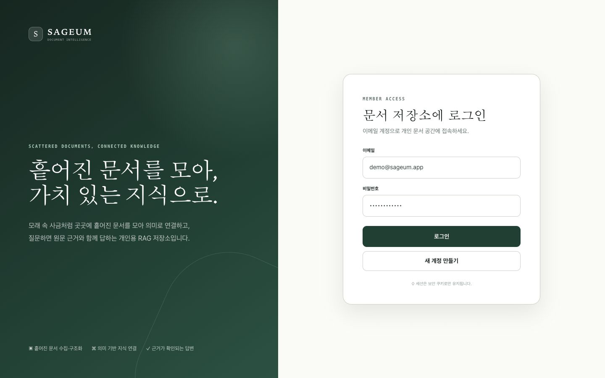
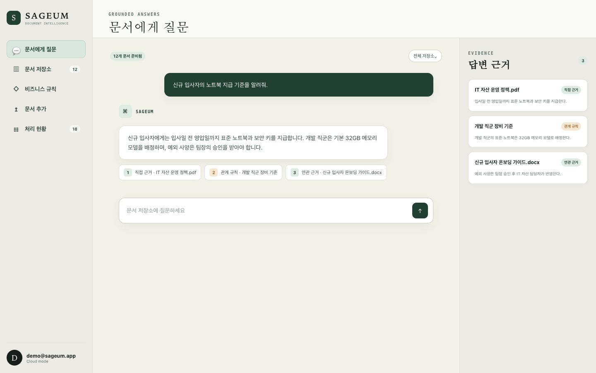
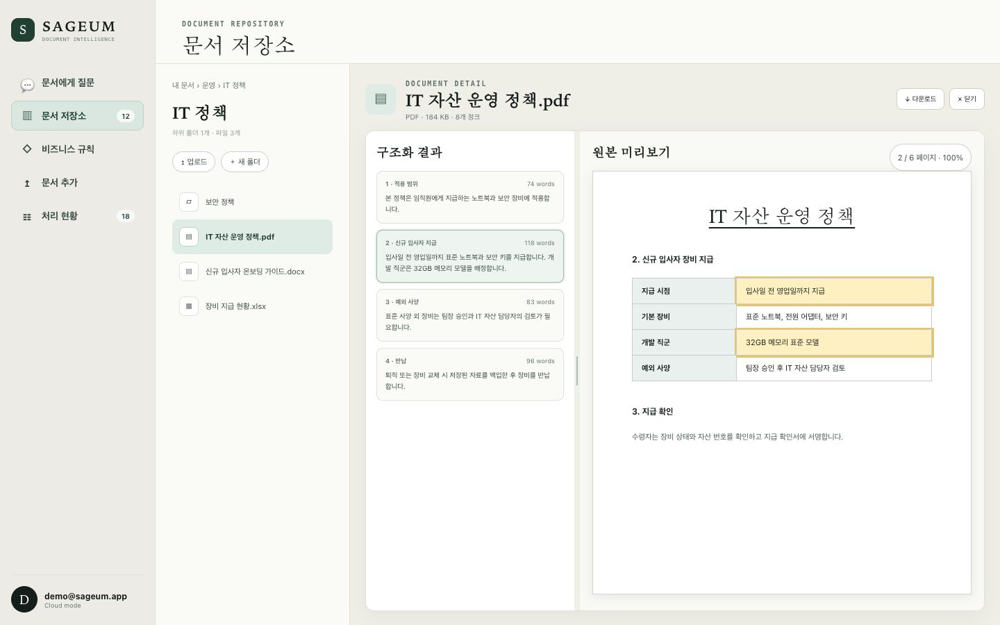
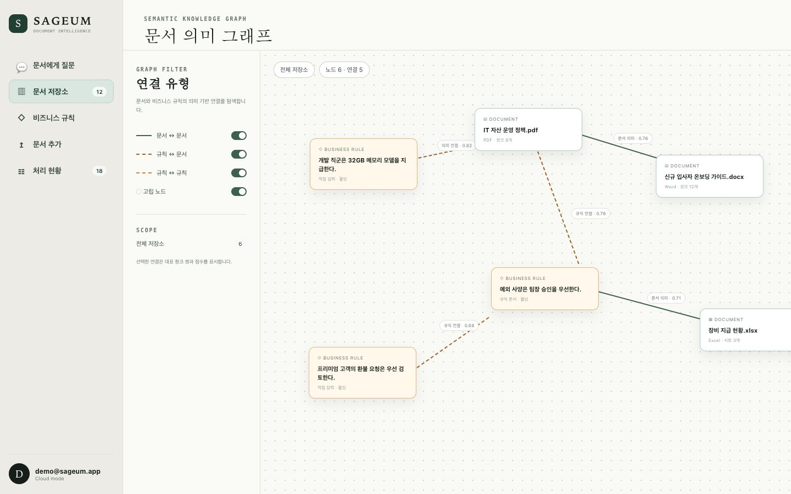
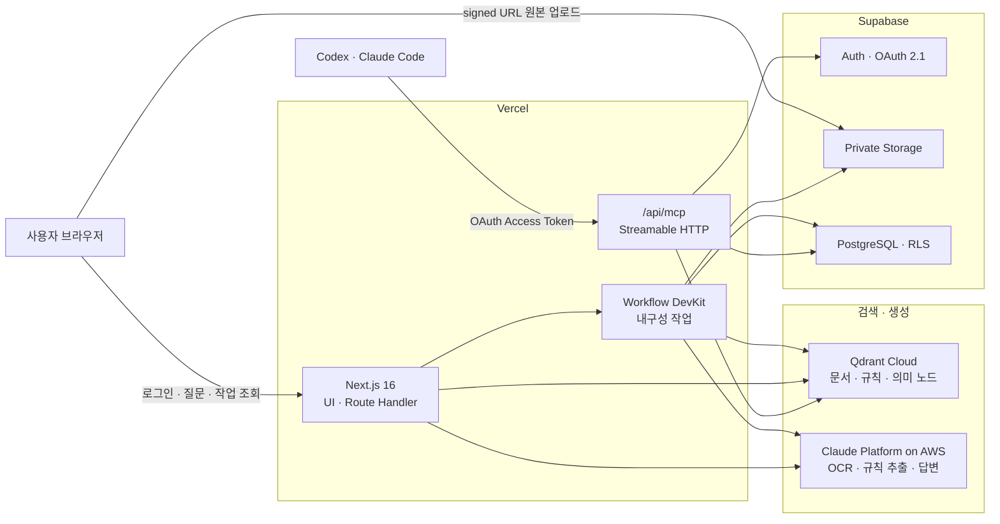
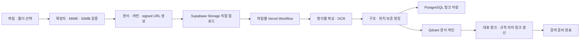
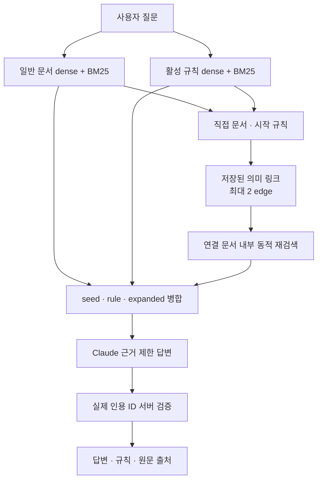

<div align="center">

<h1>SAGEUM</h1>

<h3>흩어진 문서를 모아, 가치 있는 지식으로.</h3>

<p>
  모래 속 사금처럼 여러 파일과 폴더에 흩어진 문서를 모아 구조화하고,<br />
  의미로 연결해 질문 가능한 지식으로 만드는 개인용 RAG 문서 저장소입니다.
</p>

<p>
  
  
  
  
  
  <a href="LICENSE"></a>
</p>

<p>
  <a href="https://sageum.vercel.app">Live Demo</a> ·
  <a href="#빠른-시작">빠른 시작</a> ·
  <a href="#아키텍처">아키텍처</a> ·
  <a href="#외부-에이전트-mcp-연결">MCP 연결</a>
</p>

</div>

---

## Sageum이 하는 일

Sageum은 원본을 안전하게 보관하는 문서 저장소이자, 검색된 근거로만 답하는 사내·개인용 RAG 인터페이스입니다. 문서에 없는 정책·예외·조직의 암묵지는 비즈니스 규칙으로 보완하고, 일반 문서와 규칙을 공통 의미 그래프로 연결합니다.

```text
흩어진 문서
    ↓ 파싱 · OCR · 단어 청킹
구조화된 지식
    ↓ 문서 · 규칙 의미 연결
근거가 확인되는 답변
```

- 원본과 메타데이터는 **Supabase private Storage + PostgreSQL**에 저장합니다.
- 한국어·다국어 임베딩과 **dense + BM25 하이브리드 검색**은 Qdrant Cloud가 담당합니다.
- 규칙과 문서의 저장된 의미 링크를 따라가되, 최종 답변 청크는 질문마다 대상 문서 안에서 다시 검색합니다.
- Claude Platform on AWS는 전달받은 근거만 사용하며, 서버가 실제 인용 ID를 다시 검증합니다.
- 같은 검색 서비스를 웹 챗봇과 OAuth 2.1 MCP가 함께 사용합니다.

## 제품 화면

아래 화면은 실제 계정 데이터가 아닌 공개용 합성 문서와 규칙으로 구성한 데모입니다.

<p align="center">
  
  <br /><sub><b>문서 저장소</b> — 흩어진 문서를 의미 있는 지식으로 바꾸는 제품 컨셉</sub>
</p>

<p align="center">
  
  <br /><sub><b>문서에게 질문</b> — 직접 근거·관계 규칙·연관 근거를 함께 표시</sub>
</p>

<p align="center">
  
  <br /><sub><b>구조화 결과 × 원본</b> — 청크와 원문 위치를 한 화면에서 비교</sub>
</p>

<p align="center">
  
  <br /><sub><b>의미 그래프</b> — 문서↔문서·규칙↔문서·규칙↔규칙 연결 탐색</sub>
</p>

## 핵심 기능

| 영역 | 제공 기능 |
| --- | --- |
| 문서 저장소 | 중첩 가상 폴더, 브레드크럼, 드래그 이동, 파일·폴더 업로드, 재귀 대량 삭제 |
| 문서 처리 | MD·TXT·HTML·PDF·DOCX·XLSX 파싱, 구조 보존, 이미지 OCR, 400단어 목표 청킹 |
| 원문 확인 | 구조화 결과와 원본의 좌우 비교, 독립 스크롤, 패널 크기 조절, 정확 위치 포커스 |
| RAG 검색 | multilingual E5 dense + BM25 + RRF, 사용자·폴더·문서 범위 필터 |
| 비즈니스 규칙 | 정책·예외·암묵지 직접 입력 또는 문서 업로드, 전체 문장 임베딩, 활성화 관리 |
| 의미 그래프 | 문서와 규칙의 비방향 의미 링크, 대표 청크 쌍, 고립 노드와 유형별 필터 |
| 근거 답변 | seed·rule·expanded 역할 분리, Claude 인용 검증, 근거 부족 시 답변 거부 |
| 비동기 처리 | Vercel Workflow, 브라우저 종료 후 지속 처리, 영구 이력, 재시도와 실패 정리 |
| 외부 에이전트 | OAuth 2.1 Streamable HTTP MCP, 사용자별 검색, 선택적 signed URL 업로드 |

## 아키텍처

### 시스템 경계



### 문서 수집 파이프라인



### 관계 인식 검색



> 의미 유사도는 **관련성 신호**입니다. 동일 사실·지지·상충을 자동 판정하지 않으며, 규칙과 문서가 충돌하면 어느 한쪽을 우선하지 않고 양쪽 근거를 함께 표시합니다.

## 빠른 시작

### 1. 요구 사항

- Node.js 22
- 이메일 Auth와 private Storage를 사용할 Supabase 프로젝트
- Cloud Inference가 활성화된 Qdrant Cloud 클러스터
- Claude Platform on AWS workspace와 API key

### 2. 설치

```bash
git clone https://github.com/NohYusung/sageum.git
cd sageum/sageum-front
npm install
cp .env.example .env.local
```

`.env.local`에 실제 서비스 값을 입력합니다. 브라우저에는 Supabase publishable 값만 노출하고 Supabase secret, Qdrant API key와 Claude API key는 서버 환경변수로만 저장합니다.

### 3. 외부 저장소 준비

Supabase 스키마와 private `documents` bucket을 준비한 뒤 Qdrant Collection과 payload index를 생성합니다.

```bash
npm run qdrant:setup
npm run qdrant:relations:setup
npm run qdrant:semantic:setup
```

### 4. 실행

```bash
npm run dev
```

- 기본 주소: `http://localhost:3000`
- 로그인 후 파일 또는 폴더를 업로드하면 처리는 Workflow에서 계속 진행됩니다.

### 5. 검증

```bash
npm test
npm run typecheck
npm run build
npm run qdrant:smoke
npm run claude:smoke
```

## 외부 에이전트 MCP 연결

배포 Endpoint는 `https://sageum.vercel.app/api/mcp`입니다. 프로필 메뉴의 `에이전트 연결 관리 → 연결 가이드`에서도 Endpoint, OAuth 승인, 재인증과 문제 해결 명령을 복사할 수 있습니다.

### Codex

```bash
codex mcp add sageum --url https://sageum.vercel.app/api/mcp
codex mcp login sageum
codex mcp list
```

- 브라우저에서 Sageum 로그인과 접근 승인을 완료합니다.
- Codex 안에서는 `/mcp`로 연결 상태와 도구를 확인합니다.
- 재인증: `codex mcp login sageum`
- 제거: `codex mcp remove sageum`

### Claude Code

```bash
claude mcp add --transport http --scope user sageum https://sageum.vercel.app/api/mcp
claude mcp login sageum
claude mcp list
claude mcp get sageum
```

- 모든 프로젝트에서 사용하려면 `user`, 현재 프로젝트만 사용하려면 `local` scope를 선택합니다.
- headless 환경: `claude mcp login sageum --no-browser`
- 제거: `claude mcp remove sageum`

### 제공 도구

| 도구 | 권한 | 설명 |
| --- | --- | --- |
| `search_repository` | 읽기 | 웹 챗봇과 같은 관계 인식 저장소 검색 |
| `list_folders` | 읽기 | 가상 폴더 계층 조회 |
| `list_documents` | 읽기 | 폴더·형식·상태별 문서 목록 조회 |
| `get_document` | 읽기 | 최신 버전과 구조화 청크 메타데이터 조회 |
| `get_chunk` | 읽기 | 청크 전체 본문과 정확한 문서 위치 조회 |
| `get_original_link` | 읽기 | 만료 시간이 있는 원본 다운로드 링크 발급 |
| `get_ingestion_status` | 읽기 | 업로드·파싱·OCR·색인 진행 상태 조회 |
| `create_upload` | 쓰기 | 문서와 2시간 signed upload URL 생성 |
| `complete_upload` | 쓰기 | 원본 PUT 확인 후 백그라운드 처리 시작 |

연결은 기본적으로 읽기 전용입니다. MCP로 문서를 등록할 때만 에이전트 연결 관리에서 해당 OAuth 클라이언트의 `업로드 허용`을 켭니다.

<details>
<summary><strong>환경변수 전체 보기</strong></summary>

```env
# Browser-safe Supabase configuration
NEXT_PUBLIC_SUPABASE_URL=https://your-project.supabase.co
NEXT_PUBLIC_SUPABASE_PUBLISHABLE_KEY=your-publishable-key
NEXT_PUBLIC_SITE_URL=http://localhost:3000

# Server-only Supabase secret
SUPABASE_SECRET_KEY=your-server-secret

# Qdrant Cloud
QDRANT_URL=https://your-cluster.cloud.qdrant.io
QDRANT_API_KEY=your-qdrant-api-key
QDRANT_COLLECTION=document_chunks_qdrant_hybrid_v2
QDRANT_RELATION_COLLECTION=knowledge_relations_qdrant_v1
QDRANT_SEMANTIC_NODE_COLLECTION=knowledge_semantic_nodes_qdrant_v1
QDRANT_INFERENCE_MODEL=intfloat/multilingual-e5-small
QDRANT_INFERENCE_DIMENSIONS=384
QDRANT_SCORE_THRESHOLD=0.2
QDRANT_RELATION_SCORE_THRESHOLD=0.35
QDRANT_RULE_BINDING_SCORE_THRESHOLD=0.2
QDRANT_RULE_RULE_SCORE_THRESHOLD=0.35
QDRANT_SEMANTIC_LINK_SCORE_THRESHOLD=0.35

# Claude Platform on AWS — Amazon Bedrock와 다른 서비스입니다.
ANTHROPIC_AWS_WORKSPACE_ID=wrkspc_example
AWS_REGION=ap-northeast-2
ANTHROPIC_AWS_API_KEY=your-claude-platform-aws-api-key
CLAUDE_AWS_MODEL=claude-haiku-4-5

# OAuth-protected MCP
SAGEUM_MCP_ALLOWED_ORIGINS=
SAGEUM_MCP_URL=http://localhost:3000/api/mcp
SAGEUM_MCP_ACCESS_TOKEN=
```

- 질문→규칙 검색은 `QDRANT_RELATION_SCORE_THRESHOLD`를 사용합니다.
- 규칙→문서 앵커는 `QDRANT_RULE_BINDING_SCORE_THRESHOLD`를 사용합니다.
- 공통 의미 링크는 `QDRANT_SEMANTIC_LINK_SCORE_THRESHOLD`를 사용합니다.
- `SAGEUM_MCP_ACCESS_TOKEN`은 로컬 스모크 테스트용이며 Vercel에는 설정하지 않습니다.

</details>

<details>
<summary><strong>Supabase · Qdrant · Claude 준비</strong></summary>

### Supabase

- 이메일 Auth와 private `documents` Storage bucket을 활성화합니다.
- Authentication의 OAuth 2.1 Server를 활성화하고 Authorization Path를 `/oauth/consent`로 설정합니다.
- Dynamic Client Registration을 활성화하면 지원 MCP 클라이언트가 자동 등록할 수 있습니다.
- `openid` scope를 사용할 경우 JWT Signing Key를 RS256 또는 ES256으로 설정합니다.
- Storage와 public 테이블은 로그인한 `auth.uid()`를 기준으로 소유권을 제한합니다.

기능별 SQL과 마이그레이션:

- [문서 삭제 정합성](docs/document-deletion-schema.sql)
- [문서 제목·파일명 일원화](docs/document-filename-title-schema.sql)
- [영구 처리 이력과 Workflow](docs/document-ingestion-schema.sql)
- [가상 폴더](docs/folder-management-schema.sql)
- [비즈니스 규칙](docs/knowledge-relations-schema.sql)
- [MCP 업로드 권한](docs/mcp-write-permissions-schema.sql)
- [OAuth 직접 쓰기 차단](docs/mcp-oauth-write-boundary-schema.sql)
- [규칙 전체 벡터 전환](docs/semantic-rule-bindings-migration.sql)
- [경로별 동적 검색 전환](docs/rule-path-dynamic-search-migration.sql)
- [통합 의미 그래프](docs/unified-semantic-graph-schema.sql)

### Qdrant

```bash
npm run qdrant:setup
npm run qdrant:relations:setup
npm run qdrant:semantic:setup
```

모델이나 Collection을 변경했거나 기존 데이터를 보정해야 할 때 재색인합니다.

```bash
npm run qdrant:reindex
npm run qdrant:relations:reindex
npm run qdrant:semantic:reindex
```

Collection의 기존 벡터 차원이 384와 다르면 setup 스크립트는 자동 삭제하지 않고 오류를 반환합니다.

### Claude Platform on AWS

- AWS Console에서 Claude Platform on AWS를 활성화하고 workspace를 만듭니다.
- workspace 생성 리전과 `AWS_REGION`을 일치시킵니다.
- API keys 화면에서 발급한 키를 `ANTHROPIC_AWS_API_KEY`에 설정합니다.
- 호출 주체에는 `aws-external-anthropic:CreateInference`와 API key 호출용 `aws-external-anthropic:CallWithBearerToken` 권한이 필요합니다.

</details>

<details>
<summary><strong>저장 책임과 데이터 구조</strong></summary>

| 저장소 | 책임 |
| --- | --- |
| Supabase Storage | ASCII 안전 버전 키를 사용하는 비공개 원본 파일 |
| PostgreSQL | 문서·버전·청크·폴더·규칙·의미 링크·작업 이력과 사용자별 RLS |
| Qdrant 문서 Collection | 일반 문서 청크 dense + BM25 벡터와 위치 payload |
| Qdrant 규칙 Collection | 전체 규칙 문장 dense + BM25 벡터와 활성 규칙 검색 |
| Qdrant 의미 Collection | 문서 대표 청크와 규칙의 공통 dense 의미 노드 |

주요 PostgreSQL 테이블:

- `documents`, `document_versions`, `document_chunks`, `folders`
- `document_ingestion_jobs`, `document_deletion_jobs`
- `rule_documents`, `knowledge_rules`
- `knowledge_rule_bindings`, `knowledge_rule_links`
- `knowledge_semantic_nodes`, `knowledge_semantic_links`, `knowledge_semantic_link_evidence`
- `mcp_repository_permissions`

Qdrant 기본 Collection:

- 일반 문서: `document_chunks_qdrant_hybrid_v2`
- 비즈니스 규칙: `knowledge_relations_qdrant_v1`
- 공통 의미 노드: `knowledge_semantic_nodes_qdrant_v1`
- dense model: `intfloat/multilingual-e5-small`, 384차원
- sparse model: `qdrant/bm25`, multilingual tokenizer

</details>

<details>
<summary><strong>파싱 · OCR · 청킹 · 처리 이력</strong></summary>

### 형식별 구조

| 형식 | 보존 정보 |
| --- | --- |
| MD · TXT · HTML | 제목, 문단, 목록, 표와 블록 순서 |
| PDF | 페이지, 텍스트 블록, 시각 자료 |
| DOCX | 제목 계층, 문단, 목록, 표, 내장 이미지 |
| XLSX | 시트, 행·열, 표, 셀 범위, Drawing 위치 |

- PDF 시각 자료는 Claude의 PDF 시각 입력으로 분석합니다.
- DOCX·XLSX의 내장 이미지는 문서·시트 위치와 연결해 OCR·설명을 추가합니다.
- HTML은 파일 내부의 `data:image/*;base64` 이미지만 처리하며 외부 URL은 가져오지 않습니다.
- OCR 실패는 텍스트 파싱을 취소하지 않고 버전 metadata에 경고로 기록합니다.

### 청킹

- 목표 400단어, 최대 500단어, 60단어 중첩
- 제목·페이지·시트·원본 블록 경계를 우선 보존
- 청크마다 문서 내 word 범위와 원본 source span 저장
- 미리보기에서 청크의 페이지·블록·셀 위치를 포커스

### 내구성 작업

1. 브라우저는 private Storage에 원본을 직접 업로드합니다.
2. Next.js가 파일별 Vercel Workflow를 시작하고 작업 ID를 반환합니다.
3. Workflow가 파싱·OCR·청킹·Qdrant 색인을 단계별로 실행합니다.
4. 브라우저를 닫아도 처리는 계속되며 일시 오류는 최대 3회 재시도합니다.
5. 처리 현황은 전체·진행 중·완료·실패 필터와 10·30·50개 페이지네이션을 제공합니다.
6. 실패 작업은 재처리하거나 Qdrant·Storage·DB 중간 데이터를 함께 정리할 수 있습니다.

### 삭제 정합성

- 삭제 시작과 작업 등록은 PostgreSQL 트랜잭션으로 묶습니다.
- 검색 노출을 먼저 차단한 뒤 Qdrant, Storage, PostgreSQL 순서로 정리합니다.
- 폴더 삭제는 서버가 하위 폴더와 문서를 다시 계산하고 문서를 최대 4개씩 병렬 정리합니다.
- 외부 리소스 삭제가 실패하면 작업을 보존하고 화면에서 다시 시도할 수 있습니다.

</details>

<details>
<summary><strong>배포와 운영 검증</strong></summary>

### Vercel

- Vercel 프로젝트의 Root Directory를 `sageum-front`로 지정합니다.
- `.env.local`의 실제 값을 Vercel Environment Variables에 등록합니다.
- `NEXT_PUBLIC_SITE_URL`과 `SAGEUM_MCP_URL`을 HTTPS 배포 주소로 설정합니다.
- Supabase secret, Qdrant API key, Claude API key는 Production·Preview 서버 환경변수로만 등록합니다.

### 스모크 테스트

```bash
npm run qdrant:smoke
npm run claude:smoke
npm run mcp:smoke
npm run mcp:smoke -- "환경 변수 명세는 무엇인가?"
```

- Qdrant 테스트는 임시 point를 색인하고 한국어 검색·소유자 필터를 검증한 뒤 삭제합니다.
- Claude 테스트는 합성 근거로 구조화 답변과 정확한 `chunkId` 인용을 확인합니다.
- MCP 검색 테스트에는 로컬용 단기 `SAGEUM_MCP_ACCESS_TOKEN`이 필요합니다.

### 배포 후 확인 순서

1. 이메일 로그인과 새 계정 생성
2. MD·PDF·DOCX·XLSX 업로드
3. Storage 원본, PostgreSQL 메타데이터, Qdrant 벡터 확인
4. 브라우저 종료 후 Workflow 처리 지속 확인
5. 질문 답변과 실제 인용 근거 확인
6. 비즈니스 규칙의 독립 근거와 의미 확장 확인
7. 문서·규칙 그래프와 대표 청크 쌍 확인
8. Codex 또는 Claude Code OAuth 연결과 MCP 검색 확인
9. 업로드 권한을 켠 클라이언트의 signed URL 업로드 확인

</details>

## 기술 스택

| 구분 | 기술 |
| --- | --- |
| Frontend · API | Next.js 16, React 19, TypeScript |
| Auth · Storage · DB | Supabase Auth, Storage, PostgreSQL, RLS |
| Vector DB · Search | Qdrant Cloud, Cloud Inference, dense + BM25 + RRF |
| Embedding | `intfloat/multilingual-e5-small` |
| Answer · OCR | Claude Haiku 4.5 on Claude Platform on AWS |
| Durable Jobs | Vercel Workflow DevKit |
| Graph UI | React Flow, Dagre |
| External Agent | Model Context Protocol, OAuth 2.1, Streamable HTTP |
| Deployment | Vercel |

## 현재 제한사항

- 대화 이력을 이용한 후속 질문 재작성은 아직 지원하지 않습니다.
- 답변은 스트리밍하지 않고 완성된 구조화 결과를 한 번에 반환합니다.
- 의미 확장은 최대 2개 경로·2개 연결 문서·4개 확장 근거·2 edge로 제한합니다.
- 의미 링크는 관련성만 나타내며 동일 사실·지지·상충 관계를 자동 판정하지 않습니다.
- PDF와 이미지 OCR은 Claude Vision 입력 토큰을 사용합니다.
- SVG·EMF·WMF 내장 이미지, HTML 외부 URL 이미지와 Markdown 별도 첨부 이미지는 OCR하지 않습니다.
- 파일당 업로드 한도는 Supabase Free 플랜을 고려한 50MB입니다.
- RAG 정답 세트와 자동 품질 평가는 아직 추가되지 않았습니다.

## 프로젝트 구조

```text
sageum/
├── sageum-front/
│   ├── scripts/                  # Qdrant · Claude setup/smoke/reindex
│   ├── src/app/api/              # 문서 · 규칙 · 검색 · OAuth · MCP Route Handler
│   ├── src/components/           # 챗 · 저장소 · 규칙 · 그래프 UI
│   ├── src/lib/documents/        # 업로드 · 검증 · 미리보기 · 문서 레이아웃
│   ├── src/lib/rag/              # 파서 공통 타입 · 청킹 · 검색 계약
│   ├── src/lib/relations/        # 규칙 · 바인딩 · 관계 검색 계약
│   ├── src/lib/semantic-graph/   # 공통 의미 노드 · 링크 모델
│   ├── src/lib/server/           # Supabase · Qdrant · Claude 서버 로직
│   ├── src/workflows/            # Vercel Workflow 오케스트레이션
│   └── test/fixtures/            # PDF · DOCX · XLSX 테스트 문서
├── docs/
│   ├── assets/readme/            # 공개용 README 데모 화면
│   └── *.sql                     # Supabase 스키마 · 마이그레이션
└── README.md
```

## 다음 작업 후보

- 실제 문서 질문·정답 세트와 RAG 품질 평가 자동화
- 대화 이력을 이용한 후속 질문 재작성
- 검색 품질에 따른 reranker 도입 검토
- Vercel 배포 환경 E2E 자동화
- 답변 스트리밍

## 라이선스

[MIT License](LICENSE)
