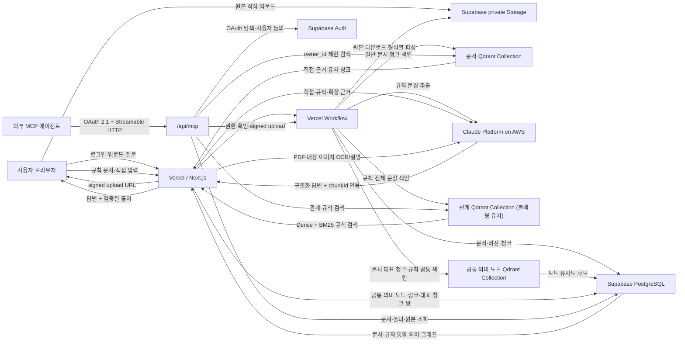

# Sageum Document Intelligence

> **흩어진 문서를 모아, 가치 있는 지식으로.**

Sageum(사금)은 모래 속에 흩어진 작은 금처럼 여러 파일과 폴더에 흩어진 문서를 모아 구조화하고, 의미로 연결해 질문 가능한 지식으로 만드는 개인용 RAG 문서 저장소입니다. 질문에 대한 답변뿐 아니라 실제 원문 근거까지 같은 화면에서 확인할 수 있습니다.

```text
흩어진 문서
    ↓ 수집·파싱·OCR·청킹
구조화된 지식
    ↓ 문서·규칙 의미 연결
근거가 확인되는 답변
```

- 원본과 메타데이터는 Supabase에 저장합니다.
- 한국어 문서 임베딩과 하이브리드 검색은 Qdrant Cloud Inference가 처리합니다.
- 일반 문서와 비즈니스 규칙을 공통 의미 노드로 색인해 문서↔문서·규칙↔문서·규칙↔규칙 관계와 확장 검색에 사용합니다.
- 최종 답변은 Claude Platform on AWS가 검색된 근거만 사용해 생성합니다.
- 기본 배포 대상은 Vercel, Supabase, Qdrant Cloud입니다.

## 주요 기능

- Supabase 이메일 인증과 사용자별 문서 격리
- 56px 아이콘 레일로 접을 수 있는 데스크톱 사이드바, 상태 저장과 모바일 상단 네비게이션
- 중첩 가능한 가상 폴더와 문서·폴더 드래그 이동
- 폴더를 지정한 직접 업로드, 로컬 폴더 구조 일괄 가져오기, 하위 폴더 포함 RAG 검색
- MD, TXT, HTML, PDF, DOCX, XLSX 업로드
- Claude Vision 기반 PDF 시각 자료·DOCX/XLSX/HTML 내장 이미지 OCR와 의미 설명
- 형식별 구조 보존
  - PDF: 페이지
  - DOCX: 제목 계층, 문단, 목록, 표
  - XLSX: 시트, 표, 셀 범위
- 구조화 결과와 원본 미리보기의 좌우 비교, 독립 스크롤과 드래그·키보드 너비 조절
- 구조 청크 선택 시 PDF 페이지·본문 블록·시트 위치로 이동하고 좁은 화면에서는 비교 탭으로 자동 전환
- 답변 근거 문서를 현재 질문 화면 위의 모달에서 원본과 구조화 결과로 확인
- 400단어 목표, 최대 500단어, 60단어 중첩의 단어 기반 청킹
- Supabase private Storage 원본 보관
- Supabase PostgreSQL 문서·버전·청크 메타데이터 저장
- Qdrant dense + BM25 sparse 하이브리드 검색과 RRF 결합
- `intfloat/multilingual-e5-small` 한국어·다국어 임베딩
- 모든 벡터 검색에 `owner_id` 필터 적용
- 일반 문서만으로 파악하기 어려운 정책·예외·조직의 암묵지를 보완하는 비즈니스 규칙
- 규칙 문서 업로드와 자연어 규칙 직접 입력·편집·활성화
- 주체·대상·관계 유형을 분리하지 않는 규칙 전체 문장 임베딩
- 사용자가 문서를 수동 매핑하지 않아도 관련 문서와 다른 규칙을 자동으로 찾는 의미 기반 연결
- 문서 대표 청크와 규칙 전체 문장을 같은 점수 보정 방식으로 비교하는 공통 의미 그래프
- 문서↔문서·규칙↔문서·규칙↔규칙 자동 연결과 고립 노드 표시
- 연결 경로가 없어도 질문과 유사한 활성 규칙을 독립 사실 근거로 사용하는 관계 인식 RAG
- 저장된 의미 링크를 최대 두 단계 따라간 뒤 후보 문서 내부를 질문별로 다시 검색
- 문서 저장소의 목록·그래프 전환, 연결 유형 필터와 대표 청크 쌍 상세
- Claude Platform on AWS 기반 근거 제한 답변
- Claude가 반환한 인용 ID를 실제 검색 청크와 다시 대조
- 근거가 없거나 유효한 인용이 없으면 답변 생성 거부
- 답변과 함께 문서명, 제목 경로, 페이지, 시트·셀 범위 표시
- Vercel Workflow 기반 비동기 문서 처리와 브라우저 종료 후 자동 재시도
- 처리 현황의 영구 이력, 전체·진행 중·완료·실패 필터, 10·30·50개 페이지네이션과 병렬 재처리
- 실패 작업의 Qdrant 벡터, Supabase 원본·문서 데이터와 처리 이력 일괄 정리
- 문서·폴더 체크 선택, 확인 모달과 하위 폴더를 포함한 재귀 대량 삭제
- Supabase OAuth 2.1로 보호된 사용자별 원격 MCP와 9개 저장소 도구
- 프로필의 에이전트 연결 관리 모달에서 제공하는 Codex·Claude Code 등록·OAuth·문제 해결 가이드
- OAuth 클라이언트별 선택적 문서 업로드 권한과 DB·Storage 직접 쓰기 차단

## 아키텍처



### 저장 책임

- Supabase Storage
  - 원본 파일을 비공개 `documents` bucket에 저장합니다.
  - Storage 객체명은 한글 원본 파일명 대신 ASCII 안전 버전 키를 사용합니다.
  - 원본 파일명은 PostgreSQL 메타데이터에 보존하고 문서 제목과 동일하게 관리합니다.
  - 이름 변경은 최신 버전 파일명과 제목을 함께 갱신하며 Storage 객체 경로는 바꾸지 않습니다.
- Supabase PostgreSQL
  - `documents`: 사용자 소유 문서와 최신 버전
  - `folders`: 사용자 가상 폴더와 상위 폴더 관계
  - `document_versions`: Storage 경로, MIME, 처리 상태, 해시
  - `document_chunks`: 청크 본문과 제목·페이지·시트 위치
  - `document_ingestion_jobs`: 영구 처리 이력, 단계, 재시도, Workflow 실행 ID
  - `document_deletion_jobs`: 외부 리소스 삭제 상태와 재시도 정보
  - `rule_documents`: 규칙 문서의 출처, 활성 상태와 추출 처리 상태
  - `knowledge_rules`: 규칙 전체 문장, 원문 근거와 활성 상태
  - `knowledge_rule_bindings`: 규칙당 문서별 최고 청크 한 개를 보존하는 정적 문서 연결 앵커
  - `knowledge_rule_links`: 규칙 벡터 유사도로 미리 계산한 방향 없는 규칙 간 연결
  - `knowledge_semantic_nodes`: 일반 문서와 개별 규칙의 공통 의미 노드
  - `knowledge_semantic_links`: canonical 비방향 의미 링크, 집계 점수와 커버리지
  - `knowledge_semantic_link_evidence`: 링크를 설명하는 중복 없는 대표 청크 쌍 최대 3개
  - `mcp_repository_permissions`: 사용자·OAuth 클라이언트별 업로드 허용 여부
  - public 테이블에는 RLS를 적용하고 `owner_id = auth.uid()`를 강제합니다.
- Qdrant
  - 일반 문서 Collection: `document_chunks_qdrant_hybrid_v2`
  - 비즈니스 규칙 Collection: `knowledge_relations_qdrant_v1`
  - 공통 의미 노드 Collection: `knowledge_semantic_nodes_qdrant_v1`
  - dense vector: `intfloat/multilingual-e5-small`, 384차원
  - sparse vector: `qdrant/bm25`, multilingual tokenizer
  - 문서·규칙 Collection은 dense + BM25 검색을 RRF로 결합하고, 공통 의미 Collection은 dense cosine만 사용합니다.
  - 관계 Collection에는 분리된 주체·대상이 아니라 규칙 전체 문장을 저장합니다.
  - 검색과 삭제에 사용자·문서·버전·규칙 필터를 적용합니다.
- Claude Platform on AWS
  - Qdrant가 검색한 상위 근거만 전달받습니다.
  - 업로드한 규칙 문서에서 의미가 완결된 규칙 문장을 구조화해 추출합니다.
  - 구조화 출력으로 답변, 인용 청크 ID, 근거 부족 여부를 반환합니다.
  - 앱 서버가 모델이 만든 인용 ID를 실제 검색 결과와 다시 검증합니다.

## 처리 흐름

### 문서 업로드

1. 파일 또는 폴더를 선택하고 저장소의 목적지 폴더를 지정합니다.
2. 폴더 업로드는 선택한 폴더를 루트로 삼아 로컬 상위 경로를 버리고, 하위 구조를 가상 폴더로 생성합니다.
3. 로그인 사용자의 파일 확장자, MIME, 크기를 검증합니다.
4. Supabase에 문서와 버전을 만들고 signed upload URL을 발급합니다.
5. 브라우저가 원본을 private Storage에 직접 업로드합니다.
6. Next.js가 파일별 Vercel Workflow를 시작하고 즉시 작업 ID를 반환합니다.
7. Workflow step이 서버 전용 Supabase 권한으로 원본을 내려받아 형식별 구조를 추출합니다.
8. PDF 시각 자료와 DOCX/XLSX/HTML 내장 이미지를 Claude Vision으로 OCR·설명합니다.
9. OCR 결과를 페이지·시트·이미지 위치가 있는 `image` 블록으로 합칩니다.
10. 구조와 위치 경계를 유지하면서 단어 수 기준으로 청킹합니다.
11. PostgreSQL에 청크를 저장하고 Qdrant Cloud Inference로 색인합니다.
12. 처리 단계와 실패 사유를 `document_ingestion_jobs`에 영구 저장하고, 일시 오류는 최대 3회 재시도합니다.
13. 브라우저는 상태만 조회하므로 처리 시작 후 창을 닫아도 서버 작업은 계속됩니다.

### 이미지 OCR

1. PDF는 Claude의 PDF 시각 입력으로 페이지별 스캔·표·차트·구조도를 분석합니다.
2. DOCX는 Mammoth가 복원한 내장 이미지와 제목 경로·미리보기 블록을 연결합니다.
3. XLSX는 Drawing relationship을 따라 이미지의 시트와 시작 셀을 보존합니다.
4. HTML은 업로드 파일 안의 `data:image/*;base64` 이미지만 처리하고 외부 URL은 가져오지 않습니다.
5. 보이는 글자, 이미지 설명, 구성요소 관계와 핵심 사실을 하나의 검색 블록으로 만듭니다.
6. OCR 호출이 실패하면 기존 텍스트 파싱은 유지하고 버전 metadata에 실패 상태를 기록합니다.

### 통합 의미 노드와 의미 링크

```text
일반 문서 업로드 / 규칙 문서·직접 입력
        |
        v
문서 대표 청크 최대 12개 / 규칙 전체 문장
        |
        v
공통 dense 임베딩과 E5 점수 보정
        |
        v
문서↔문서 / 규칙↔문서 / 규칙↔규칙 링크
        |
        +-- 웹·MCP 질문별 후보 문서 내부 재검색
        +-- 통합 의미 그래프와 고립 노드
```

1. 일반 문서만으로 파악하기 어려운 정책·예외·조직의 암묵지를 지원 문서 형식으로 업로드하거나 자연어 한 문장으로 직접 입력합니다.
2. 업로드한 규칙 문서는 기존 파서·OCR·청커를 거친 뒤 Claude가 의미가 완결된 규칙 문장을 추출합니다.
3. 직접 입력은 입력한 전체 문장을 하나의 규칙으로 사용하며 별도의 주체·대상·관계 유형으로 분리하지 않습니다.
4. 일반 문서는 첫·마지막, 서로 다른 제목 경로, 균등 분산 순으로 대표 청크를 최대 12개 선택하고 규칙은 전체 문장 한 개를 사용합니다.
5. 문서와 규칙을 `knowledge_semantic_nodes_qdrant_v1`에 같은 dense 모델로 저장하고, 다른 의미 노드의 근접 청크를 조회합니다.
6. 양쪽 청크가 중복되지 않도록 최대 3개 쌍을 선택하고 `0.8 × 평균 유사도 + 0.2 × 커버리지`로 링크 점수를 계산합니다.
7. 임계값을 넘은 노드당 상위 5개를 canonical 비방향 링크와 대표 청크 쌍으로 저장합니다. 의미 유사도는 관련성이지 동일 사실·지지·상충 판정이 아닙니다.
8. 규칙 문서와 개별 규칙은 각각 활성화하거나 비활성화할 수 있습니다.
9. 직접 입력 규칙은 수정할 수 있으며 새 버전 처리에 실패하면 기존 활성 규칙·앵커·규칙 연결을 유지합니다.
10. 문서나 규칙이 추가·수정되면 해당 공통 노드의 point와 incident link만 증분 갱신하며, 실패는 원문 등록을 막지 않고 metadata 경고로 기록합니다.
11. 그래프는 연결 없는 문서·독립 규칙도 표시하고 문서↔문서, 규칙↔문서, 규칙↔규칙과 고립 노드를 각각 필터링할 수 있습니다.
12. 연결선을 선택하면 최종 점수, 커버리지와 양쪽 대표 청크 원문을 확인할 수 있습니다.

### 폴더 관리

1. 폴더 계층은 PostgreSQL의 `folders.parent_id`로 관리합니다.
2. 문서 이동은 `documents.folder_id`만 갱신하고 Storage 원본은 이동하지 않습니다.
3. 폴더 이동은 자기 자신이나 하위 폴더 아래로 들어가는 순환 구조를 거부합니다.
4. 문서·폴더 드래그 이동은 낙관적으로 반영하고 서버 실패 시 원래 위치로 복구합니다.
5. 폴더 범위 질문은 해당 폴더와 모든 하위 폴더의 문서 ID만 Qdrant 필터로 전달합니다.
6. 폴더 이동은 본문이 변하지 않으므로 Qdrant 재임베딩을 수행하지 않습니다.
7. 로컬 폴더 업로드는 같은 부모의 동일 이름 폴더를 재사용하고 누락된 하위 폴더만 추가합니다.

### 문서 확인과 탐색

1. 문서 저장소는 현재 폴더의 하위 폴더와 파일을 탐색기 형태로 표시하고 브레드크럼으로 상위 경로를 이동합니다.
2. 문서를 선택하면 너비를 조절할 수 있는 우측 상세 패널이 열리고, 닫기 버튼으로 저장소 목록에 집중할 수 있습니다.
3. 상세 패널은 `구조화 결과 | 원본 미리보기`를 좌우에 표시하며 양쪽 영역은 서로 독립적으로 스크롤합니다.
4. 내부 구분선은 드래그하거나 방향키·Home·End로 조절할 수 있고, 외부 상세 패널과 내부 구조 영역의 마지막 너비를 브라우저에 저장합니다.
5. 구조 청크를 선택하면 오른쪽 원본이 해당 PDF 페이지, 문서 블록 또는 시트 위치로 이동하고 선택 범위를 강조합니다.
6. 비교 영역이 좁아지면 구조화 결과와 원본 미리보기 탭으로 전환하며, 구조 청크 선택 후 원본 탭을 자동으로 엽니다.
7. 답변에 표시된 출처를 선택하면 문서 저장소 탭으로 이동하지 않고 같은 문서 상세 화면을 모달로 열어 확인합니다.
8. 데스크톱 사이드바는 56px 아이콘 레일로 접을 수 있으며, 마지막 상태를 브라우저에 보존하고 720px 이하에서는 기존 상단 네비게이션을 사용합니다.

### 질문과 답변

1. 로그인 사용자의 질문을 Qdrant에 전달합니다.
2. 일반 문서 직접 검색과 관계 Collection의 dense + BM25 규칙 검색을 처음부터 병렬 실행하고 RRF로 규칙 순위를 결합합니다.
3. 활성 규칙이 검색되면 규칙 노드만 시작점으로 사용하고, 규칙이 없을 때만 검색 점수 0.5 이상의 문서 Seed를 시작점으로 사용해 저장된 공통 의미 링크를 탐색합니다. 문서→문서는 최대 1 edge, 규칙→규칙→문서는 최대 2 edge입니다.
4. 저장된 대표 청크 쌍은 후보 문서 ID와 연결 이유만 결정하며 최종 답변 근거로 직접 사용하지 않습니다.
5. 의미 경로를 최대 2개 선택하고 연결 문서 최대 2개 안에서 Qdrant 검색을 병렬 실행합니다.
6. 경로 검색의 dense 질의에는 원 질문과 경로 규칙 문장을 함께 넣고, BM25 질의에는 `구조` 같은 실제 검색어를 보존하기 위해 원 질문만 넣습니다.
7. 같은 청크가 직접 근거와 연관 근거에 모두 나오면 직접 근거 하나만 유지하며 연관 근거는 전체 최대 4개만 반환합니다.
8. 폴더·문서 범위 질문은 규칙의 후보 문서 선택과 경로별 재검색 모두 같은 범위를 벗어나지 않으며, 범위 문서 경로가 없는 독립 규칙은 제외합니다.
9. Claude에는 `직접 근거(seed)`, `관계 규칙(rule)`, `연관 근거(expanded)`를 구분하고 의미 링크가 관련성 신호일 뿐이라는 제한을 함께 전달합니다.
10. 질문과 유사한 활성 시작 규칙은 연결 경로나 동적 문서 근거가 없어도 독립적인 `rule` 사실 근거로 Claude와 MCP에 전달합니다.
11. 규칙 문장에 없는 세부 내용은 생성하지 않으며, 규칙과 일반 문서가 충돌하면 어느 한쪽을 우선하지 않고 양쪽 근거와 충돌 사실을 함께 표시합니다.
12. 일부 문서 경로 검색이 실패해도 성공한 경로와 일반 검색은 유지하며, 관계 Collection이나 의미 링크 조회가 실패한 경우 `relationMode: fallback`을 반환합니다. 의미 링크 장애 전 이미 검색된 독립 규칙은 가능한 범위에서 유지합니다.
13. Claude가 검색 근거만 사용해 한국어 답변과 인용 청크 ID를 생성하고 서버가 유효한 출처만 반환합니다.

### 외부 에이전트 MCP

1. 원격 엔드포인트는 `/api/mcp`이며 stateless Streamable HTTP POST를 사용합니다.
2. MCP 보호 리소스 메타데이터가 Supabase OAuth 2.1 Authorization Server를 안내합니다.
3. 외부 에이전트는 브라우저에서 Sageum 로그인과 사용자 동의를 완료하고 Access Token을 발급받습니다.
4. 서버는 JWT 서명·발급자·만료·`client_id`를 검증하고 `sub`를 문서 `owner_id`로 사용합니다.
5. DB 조회는 OAuth Access Token과 RLS를 사용하며 Qdrant에도 검증된 `owner_id` 필터를 강제합니다.
6. `search_repository`는 웹 챗봇과 같은 공통 의미 경로별 동적 검색을 사용하고 `relationMode`, `appliedRules`, `appliedSemanticLinks`와 `seed | rule | expanded` 근거 역할을 반환합니다.
7. `list_folders`, `list_documents`, `get_document`, `get_chunk`, `get_original_link`를 읽기 전용으로 제공합니다.
8. `get_ingestion_status`로 업로드·파싱·OCR·색인 상태와 실패 사유를 조회합니다.
9. 사용자가 클라이언트별 업로드 권한을 켜면 `create_upload`가 2시간 signed URL을 발급하고, 원본 PUT 후 `complete_upload`가 Workflow를 시작합니다.
10. Supabase OAuth가 사용자 정의 scope를 지원하지 않으므로 쓰기 권한은 `owner_id + client_id`로 별도 관리합니다.
11. OAuth 토큰의 Data API·Storage 직접 쓰기는 RLS로 차단하며, 검증된 업로드만 Sageum 서버가 수행합니다.
12. 외부 에이전트가 검색 근거를 직접 판단하며 Sageum의 Claude 답변을 중복 호출하지 않습니다.

프로필 메뉴에서 `에이전트 연결 관리 → 연결 가이드`를 열면 현재 배포 Endpoint와 Codex·Claude Code 등록, OAuth 승인, 재인증·삭제·문제 해결 방법을 확인하고 명령어를 복사할 수 있습니다. 외부 클라이언트에는 localhost가 아닌 HTTPS 배포 Endpoint를 사용합니다.

#### Codex 연결

```bash
codex mcp add sageum --url https://sageum.vercel.app/api/mcp
codex mcp login sageum
codex mcp list
```

- 브라우저에서 Sageum 로그인과 접근 승인을 완료한 뒤 Codex 안에서 `/mcp`로 연결 상태와 도구를 확인합니다.
- 재인증은 `codex mcp login sageum`, 제거는 `codex mcp remove sageum`을 사용합니다.

#### Claude Code 연결

```bash
claude mcp add --transport http --scope user sageum https://sageum.vercel.app/api/mcp
claude mcp login sageum
claude mcp list
claude mcp get sageum
```

- `user` scope는 모든 프로젝트에서 사용합니다. 특정 프로젝트에만 연결하려면 `--scope local`로 바꿉니다.
- 브라우저를 열 수 없는 환경에서는 `claude mcp login sageum --no-browser`, 제거에는 `claude mcp remove sageum`을 사용합니다.
- 연결은 기본적으로 읽기 전용입니다. MCP로 문서를 업로드할 때만 에이전트 연결 관리에서 해당 클라이언트의 `업로드 허용`을 켭니다.

### 문서 삭제

1. 삭제 요청과 `document_deletion_jobs` 등록을 하나의 PostgreSQL 트랜잭션으로 처리합니다.
2. 삭제 중인 문서는 즉시 일반 검색과 원본 접근에서 제외합니다.
3. Qdrant 벡터를 `owner_id + document_id` 필터와 strong ordering으로 삭제합니다.
4. Supabase Storage 원본을 삭제합니다. 이미 없는 원본은 삭제 완료 상태로 취급합니다.
5. 마지막 PostgreSQL 트랜잭션이 `documents`를 삭제하고 버전·청크·삭제 작업을 cascade 정리합니다.
6. 외부 삭제가 실패하면 작업을 보존하고 일반 사용자가 화면에서 재시도할 수 있습니다.
7. 문서 저장소에서는 파일과 폴더를 체크해 한 번에 삭제할 수 있으며 삭제 전에 대상 개수를 확인합니다.
8. 폴더 삭제는 서버가 하위 폴더와 포함 문서를 다시 계산하고 문서를 최대 4개씩 병렬 정리합니다.
9. 폴더 안 문서 정리가 모두 성공한 경우에만 `delete_folder_trees`가 폴더 트리를 하나의 DB 트랜잭션으로 삭제합니다.

### 실패 작업 정리

1. 처리 현황의 실패 카드에서만 `작업 정리`를 제공합니다.
2. DB가 실패 작업을 잠그고 문서를 삭제 중으로 전환해 재시도와 정리가 동시에 실행되지 않게 합니다.
3. Qdrant 벡터와 Supabase Storage 원본을 지운 뒤 문서·버전·청크와 처리 이력을 하나의 DB 트랜잭션에서 삭제합니다.
4. 외부 리소스 정리가 실패하면 처리 이력을 유지하고 `정리 다시 시도`를 제공합니다.

## 기술 스택

- Frontend/API: Next.js 16, React 19, TypeScript
- Auth/Storage/Database: Supabase
- Vector DB/Search: Qdrant Cloud, Qdrant Cloud Inference
- Embedding: `intfloat/multilingual-e5-small`
- Document graph: React Flow, Dagre
- Answer model: Claude Haiku 4.5 on Claude Platform on AWS
- Durable jobs: Vercel Workflow DevKit
- Deployment target: Vercel

## 로컬 실행

### 요구 사항

- Node.js 22
- Supabase 프로젝트
- Qdrant Cloud 클러스터와 Cloud Inference 사용 권한
- Claude Platform on AWS workspace와 API key

### 설치

```bash
cd sageum-front
cp .env.example .env.local
npm install
```

`.env.local`에 실제 환경변수를 입력합니다. 이 파일은 Git에 커밋하지 않습니다.

```env
# Browser-safe Supabase configuration
NEXT_PUBLIC_SUPABASE_URL=https://your-project.supabase.co
NEXT_PUBLIC_SUPABASE_PUBLISHABLE_KEY=your-publishable-key
NEXT_PUBLIC_SITE_URL=http://localhost:3000

# Server-only Supabase secret
SUPABASE_SECRET_KEY=your-server-secret

# Qdrant Cloud
QDRANT_URL=https://your-cluster.cloud.qdrant.io
QDRANT_API_KEY=your-qdrant-api-key
QDRANT_COLLECTION=document_chunks_qdrant_hybrid_v2
QDRANT_RELATION_COLLECTION=knowledge_relations_qdrant_v1
QDRANT_SEMANTIC_NODE_COLLECTION=knowledge_semantic_nodes_qdrant_v1
QDRANT_INFERENCE_MODEL=intfloat/multilingual-e5-small
QDRANT_INFERENCE_DIMENSIONS=384
QDRANT_SCORE_THRESHOLD=0.2
QDRANT_RELATION_SCORE_THRESHOLD=0.35
QDRANT_RULE_BINDING_SCORE_THRESHOLD=0.2
QDRANT_RULE_RULE_SCORE_THRESHOLD=0.35
QDRANT_SEMANTIC_LINK_SCORE_THRESHOLD=0.35

# Claude Platform on AWS — Amazon Bedrock와 다른 서비스입니다.
ANTHROPIC_AWS_WORKSPACE_ID=wrkspc_example
AWS_REGION=ap-northeast-2
ANTHROPIC_AWS_API_KEY=your-claude-platform-aws-api-key
CLAUDE_AWS_MODEL=claude-haiku-4-5

# OAuth-protected MCP
SAGEUM_MCP_ALLOWED_ORIGINS=
SAGEUM_MCP_URL=http://localhost:3000/api/mcp
SAGEUM_MCP_ACCESS_TOKEN=
```

- `NEXT_PUBLIC_` 접두사는 브라우저에 공개해도 되는 Supabase 값에만 사용합니다.
- Supabase secret, Qdrant API key, Claude API key는 서버 환경변수로만 저장합니다.
- 질문→규칙 하이브리드 검색은 `QDRANT_RELATION_SCORE_THRESHOLD`, 규칙→문서 바인딩은 `QDRANT_RULE_BINDING_SCORE_THRESHOLD`, 저장된 노드→노드 의미 링크는 `QDRANT_SEMANTIC_LINK_SCORE_THRESHOLD`를 사용합니다.
- Claude workspace의 생성 리전과 `AWS_REGION`이 일치해야 합니다.
- `SAGEUM_MCP_ACCESS_TOKEN`은 로컬 스모크 테스트용 단기 OAuth 토큰이며 Vercel에는 설정하지 않습니다.
- MCP의 실제 사용자 범위는 검증된 Supabase OAuth JWT의 `sub`에서 결정됩니다.

### 개발 서버

```bash
npm run dev
```

- 기본 주소: `http://localhost:3000`
- 이메일 계정을 생성하고 로그인한 뒤 문서를 업로드할 수 있습니다.

## 외부 서비스 준비

### Supabase

- 이메일 Auth를 활성화합니다.
- **Authentication > OAuth Server**에서 OAuth 2.1 Server를 활성화합니다.
- Authorization Path는 `/oauth/consent`로 설정합니다.
- 외부 MCP 클라이언트의 자동 연결이 필요하면 Dynamic Client Registration을 활성화합니다.
- OAuth 동의 화면은 Sageum의 `/oauth/consent`가 제공하며 사용자는 연결을 명시적으로 승인하거나 거부합니다.
- `openid` scope를 사용할 경우 JWT Signing Key를 RS256 또는 ES256으로 전환합니다.
- private `documents` Storage bucket을 준비합니다.
- `documents`, `document_versions`, `document_chunks` 테이블과 사용자별 RLS 정책이 필요합니다.
- 삭제 정합성 스키마는 `docs/document-deletion-schema.sql`을 적용합니다.
- 가상 폴더 스키마는 `docs/folder-management-schema.sql`에 기록되어 있습니다.
- 제목·파일명 일원화와 기존 문서 보정은 `docs/document-filename-title-schema.sql`을 적용합니다.
- 영구 처리 이력과 Workflow 필드는 `docs/document-ingestion-schema.sql`에 기록되어 있습니다.
- MCP 업로드 권한과 OAuth 직접 쓰기 차단은 `docs/mcp-write-permissions-schema.sql`, `docs/mcp-oauth-write-boundary-schema.sql`에 기록되어 있습니다.
- 비즈니스 규칙·의미 바인딩·그래프 스키마는 `docs/knowledge-relations-schema.sql`을 적용합니다.
- 기존 주체·대상 기반 관계 스키마를 사용했다면 `docs/semantic-rule-bindings-migration.sql`로 규칙 전체 벡터 방식으로 전환합니다.
- 기존 의미 바인딩 구조는 `docs/rule-path-dynamic-search-migration.sql`로 문서별 단일 앵커와 규칙 간 연결 구조로 전환합니다.
- 통합 문서·규칙 의미 그래프는 `docs/unified-semantic-graph-schema.sql`을 적용합니다. 레거시 규칙 바인딩·링크 테이블은 롤백용으로 유지합니다.
- Storage와 데이터베이스의 사용자 소유권은 모두 로그인한 `auth.uid()`를 기준으로 제한합니다.

### Qdrant

- `.env.local`을 설정한 뒤 Collection과 payload index를 준비합니다.

```bash
npm run qdrant:setup
npm run qdrant:relations:setup
npm run qdrant:semantic:setup
```

- 두 Collection 중 하나라도 벡터 차원이 384와 다르면 자동으로 삭제하지 않고 오류를 반환합니다.
- 임베딩 모델이나 일반 문서 Collection을 변경하면 기존 문서를 다시 색인해야 합니다.

```bash
npm run qdrant:reindex
npm run qdrant:relations:reindex
npm run qdrant:semantic:reindex
```

- `qdrant:relations:reindex`는 규칙 벡터, 문서별 최고 앵커와 규칙 간 상위 연결을 모두 재생성합니다.
- `qdrant:semantic:reindex`는 기존 일반 문서와 활성 규칙의 공통 노드·의미 링크·대표 청크 쌍을 재생성합니다.

### Claude Platform on AWS

- AWS Console에서 Claude Platform on AWS를 활성화합니다.
- workspace를 만들고 생성 리전을 확인합니다.
- Claude Platform on AWS의 API keys 화면에서 발급한 실제 키 값을 사용합니다.
- 호출 주체에는 workspace 대상 `aws-external-anthropic:CreateInference` 권한이 필요합니다.
- API key 인증에는 `aws-external-anthropic:CallWithBearerToken` 권한도 필요합니다.

## 검증 명령

```bash
cd sageum-front
npm test
npm run typecheck
npm run build
```

### Qdrant 스모크 테스트

```bash
npm run qdrant:smoke
```

- 임시 문서 청크를 색인합니다.
- 한국어 유사어 질문, 하이브리드 검색, 소유자 필터를 검증합니다.
- 테스트가 끝나면 임시 point를 삭제합니다.

### Claude 스모크 테스트

```bash
npm run claude:smoke
```

- Claude Platform on AWS 인증과 모델 호출을 검증합니다.
- 합성 한국어 근거로 구조화 답변과 정확한 `chunkId` 인용을 확인합니다.
- 실제 사용자 문서나 API 키를 출력하지 않습니다.

### MCP 스모크 테스트

```bash
npm run mcp:smoke
npm run mcp:smoke -- "환경 변수 명세는 무엇인가?"
```

- OAuth로 발급한 단기 Access Token을 `SAGEUM_MCP_ACCESS_TOKEN`에 넣습니다.
- 첫 명령은 OAuth 인증, 프로토콜 연결과 저장소 도구를 확인합니다.
- 질문을 추가하면 실제 Qdrant 저장소 검색까지 확인합니다.
- OAuth 지원 외부 에이전트에는 `https://sageum.vercel.app/api/mcp` URL만 등록하면 브라우저 승인이 시작됩니다.
- 문서 업로드는 `/oauth/connections`에서 해당 클라이언트의 `업로드 허용`을 켠 뒤 `create_upload → PUT → complete_upload → get_ingestion_status` 순서로 실행합니다.

## 배포

- `sageum-front`를 Vercel 프로젝트의 Root Directory로 지정합니다.
- `.env.local`의 값을 Vercel Environment Variables에 각각 등록합니다.
- `NEXT_PUBLIC_SITE_URL`은 실제 Vercel 배포 주소로 설정합니다.
- API 키 세 종류는 반드시 Production/Preview 서버 환경변수로만 등록합니다.
- 배포 후 다음 순서로 확인합니다.
  1. 이메일 로그인
  2. 문서 업로드
  3. Supabase Storage와 데이터베이스 저장
  4. Qdrant 색인
  5. 문서 질문과 Claude 답변
  6. 규칙 문서 또는 직접 입력 규칙 등록과 의미 바인딩
  7. 관계 확장 답변의 직접·규칙·확장 근거 표시
  8. 문서 저장소의 그래프 연결선과 규칙 상세
  9. 페이지·시트 위치가 포함된 출처 표시
  10. `/api/mcp` OAuth 브라우저 승인과 관계 확장 저장소 검색
  11. MCP 클라이언트 업로드 권한, signed URL PUT, 백그라운드 처리 상태 조회

## 현재 제한사항

- OCR은 JPEG, PNG, GIF, WebP 내장 이미지를 지원하며 SVG, EMF, WMF는 건너뜁니다.
- HTML의 외부 이미지 URL과 Markdown의 별도 첨부 이미지는 원본 파일에 포함되지 않으므로 OCR하지 않습니다.
- PDF 전체와 이미지 OCR은 Claude Vision 입력 토큰을 사용합니다.
- 각 질문은 독립적으로 검색합니다. 대화 이력을 이용한 후속 질문 재작성은 아직 없습니다.
- 답변은 스트리밍하지 않고 완성된 구조화 결과를 한 번에 반환합니다.
- 의미 확장 검색은 경로 최대 2개, 연결 문서 최대 2개, 확장 근거 최대 4개이며 전체 경로는 최대 2 edge입니다.
- 의미 링크는 관련성만 나타내며 동일 사실·지지·상충 관계를 자동 판정하지 않습니다.
- 활성 규칙은 독립적인 사실 근거로 사용할 수 있지만 규칙 문장에 없는 원인·시점·세부 속성은 추론하지 않습니다.
- 규칙과 일반 문서 또는 규칙끼리 충돌하면 자동 우선순위를 정하지 않고 상충 내용을 함께 답변합니다.
- RAG 정답 세트와 자동 품질 평가는 아직 추가되지 않았습니다.
- 앱은 Supabase Free 플랜의 Storage 상한에 맞춰 파일당 최대 50MB를 허용합니다.

## 프로젝트 구조

```text
sageum/
├── sageum-front/                 # 현재 RAG 제품 경로
│   ├── scripts/                  # Qdrant·Claude setup/smoke/reindex
│   ├── src/app/api/              # 문서·규칙 처리, 검색·그래프 Route Handler
│   ├── src/components/           # 문서 저장소·챗·규칙·그래프 UI
│   ├── src/lib/documents/        # 업로드·검증·저장소 매핑·미리보기 레이아웃
│   ├── src/lib/rag/              # 파서 공통 타입·청킹·검색 계약
│   ├── src/lib/relations/        # 규칙·바인딩·관계 검색 공통 계약
│   ├── src/lib/semantic-graph/   # 공통 의미 노드 선택·점수·canonical 링크 모델
│   ├── src/lib/server/           # Supabase·Qdrant·Claude·관계 RAG 서버 로직
│   ├── src/workflows/            # Vercel Workflow 문서 처리 오케스트레이션
│   └── test/fixtures/            # PDF·DOCX·XLSX 테스트 문서
└── docs/                         # 설계 기록
```

## 다음 작업 후보

- 실제 문서 질문·정답 세트와 RAG 품질 평가 자동화
- 대화 이력을 이용한 후속 질문 재작성
- 검색 품질에 따른 reranker 도입 검토
- Vercel 배포 환경 E2E 검증
- 답변 스트리밍

## 라이선스

- [MIT License](LICENSE)
