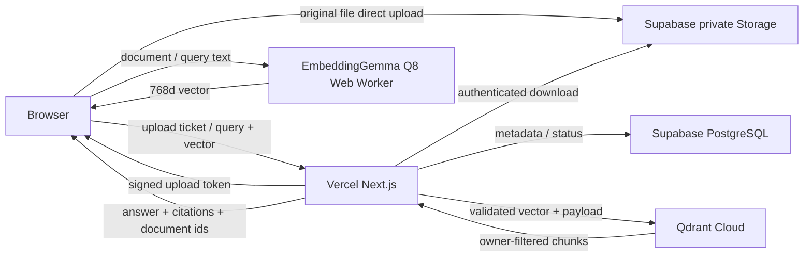

# Sageum RAG Architecture

## 제품 목표

- 사용자가 MD, HTML, TXT, PDF, DOCX, XLSX 파일을 올린다.
- 시스템은 문서의 제목·페이지·시트·셀 범위 같은 구조를 보존해 정규화한다.
- 정규화된 본문을 400단어 목표, 최대 500단어, 60단어 중첩으로 청킹한다.
- 질문 시 사용자 소유 문서만 벡터 검색하고 답변과 인용 청크, 원문 문서를 함께 반환한다.
- 검색 근거가 없으면 답변을 생성하지 않는다.

## 런타임 경계

- 브라우저는 Supabase publishable key만 가지며 Qdrant API key를 갖지 않는다.
- EmbeddingGemma 300M ONNX Q8은 Web Worker에서 실행하고 모델 파일은 브라우저 캐시에 보관한다.
- 파일 원본은 Vercel 요청 본문을 통과하지 않고 signed upload URL로 Storage에 직접 전송한다.
- 파일 파싱, Qdrant 접근, 사용자 소유 데이터 저장은 Next.js Node.js Route Handler에서 수행한다.
- 문서·질문 임베딩은 브라우저에서 수행하되 서버가 사용자 소유권, 문서 버전, 전체 청크 ID, 모델·차원을 검증한 뒤에만 Qdrant에 기록한다.
- 파일당 앱 검증 한도는 50MB이며 원본은 Vercel 요청 본문을 거치지 않고 Supabase Storage로 직접 전송한다.

## 저장 책임

### Supabase Storage

- bucket: `documents`
- public: `false`
- object path: `{owner_id}/{document_id}/{version_id}/{original_filename}`
- 처리는 사용자 세션과 RLS를 적용한 서버 다운로드를 사용하고, 사용자 다운로드 링크는 signed URL로 제공한다.

### Supabase PostgreSQL

- `documents`
  - `id uuid primary key`
  - `owner_id uuid references auth.users`
  - `title text`, `source_type text`, `latest_version_id uuid`
  - `created_at`, `updated_at`
- `document_versions`
  - `id uuid primary key`, `document_id uuid`, `owner_id uuid`
  - `storage_path text`, `mime_type text`, `size_bytes bigint`
  - `status text`: `uploaded | parsing | indexing | ready | failed`
  - `content_hash text`, `error_message text`, `created_at`
- `document_chunks`
  - `id text primary key`, `document_id uuid`, `version_id uuid`, `owner_id uuid`
  - `ordinal integer`, `word_count integer`, `heading_path text[]`
  - `page integer`, `sheet text`, `cell_range text`
  - `text text`, `created_at`

- 모든 public 테이블에 RLS를 활성화한다.
- select, insert, update, delete 정책은 모두 `owner_id = auth.uid()`를 강제한다.
- 새 테이블은 `anon`, `authenticated` 역할에 필요한 권한을 명시적으로 grant한다.
- secret key는 서버 전용이며 브라우저 코드에 포함하지 않는다.

### Qdrant

- collection: `document_chunks_embeddinggemma_q8`
- distance: cosine
- vector size: 선택한 임베딩 모델의 차원과 동일
- point id: 청크 ID를 입력으로 만든 결정적 UUID
- payload:
  - `owner_id`, `document_id`, `version_id`, `chunk_id`
  - `document_title`, `source_type`, `ordinal`, `text`, `heading_path`
  - `embedding_model`: 서로 다른 모델의 768차원 벡터가 섞이지 않도록 검색 시 강제 필터
  - `page`, `sheet`, `cell_range`
- payload index:
  - UUID: `owner_id`, `document_id`, `version_id`
  - keyword: `source_type`
  - keyword: `embedding_model`
- 모든 query는 `owner_id`와 `embedding_model` must-filter를 포함한다.
- 선택 문서 검색은 `document_id match any`를 추가하고, 삭제는 `owner_id`와 문서·버전을 함께 필터한다.
- strict mode에서 필터가 거부되지 않도록 컬렉션 사용 전에 payload index를 생성한다.
- 기존 Collection 벡터 차원이 설정과 다르면 자동 재생성하지 않고 운영 오류로 반환한다.

## 수집 파이프라인

1. 인증과 파일 크기·확장자·MIME를 검증한다.
2. `uploaded` 버전과 사용자 경로로 제한된 signed upload URL을 만든다.
3. 브라우저가 원본을 private Storage에 직접 업로드한다.
4. 형식별 파서로 `NormalizedDocument`와 위치 정보를 가진 block을 만든다.
5. block 경계를 우선해 단어 수 기준 청크를 만든다.
6. PostgreSQL에 청크를 저장하고 버전을 `indexing`으로 전환한다.
7. 브라우저 Web Worker가 공식 retrieval document 프롬프트로 청크를 Q8 배치 임베딩한다.
8. 서버가 전달된 벡터의 사용자 소유권, 전체 청크 일치, 모델, Q8 dtype, 768차원을 검증한다.
9. Qdrant 컬렉션·payload index를 확인하고 point를 upsert한 뒤 버전을 `ready`로 전환한다.
9. 중간 실패 시 버전을 `failed`로 표시하고 기존 ready 버전은 검색 가능 상태로 유지한다.

## 검색·답변 계약

- 입력: `query`, 선택적 `document_ids`, `top_k`
- 검색:
  - 브라우저에서 공식 retrieval query 프롬프트로 질문 임베딩
  - `owner_id`와 선택 문서 필터를 적용한 Qdrant query
  - 개인 데모 기본 `top_k = 8`
- 답변 모델 입력:
  - 사용자 질문
  - 점수순 청크 텍스트
  - 문서명, 제목 경로, 페이지·시트 위치
  - 근거가 없으면 답변을 거부하라는 시스템 규칙
- 출력:
  - `answer`
  - `citations[]`: `document_id`, `version_id`, `chunk_id`, 위치, score
  - `documents[]`: 제목, 원본 파일명, 다운로드용 식별자

## 무료 개인 데모 제약

- 앱과 Supabase Free 플랜의 Storage 상한을 파일당 50MB로 맞춘다.
- 동시 처리와 임베딩 배치 크기를 작게 유지한다.
- 첫 실행에는 약 330MB 모델 다운로드가 필요하며 이후 브라우저 캐시를 재사용한다.
- Vercel 함수에서 장시간 queue worker를 운영하지 않는다.
- 무료 한도를 넘으면 새 업로드를 거부하되 기존 검색은 유지한다.
- Qdrant MCP는 컬렉션 운영 확인에 사용할 수 있지만, 앱 런타임은 공식 JS SDK를 사용한다.

## 구현 순서

- 완료: 새 UI, MD/HTML/TXT 정규화, 단어 청킹, 로컬 검색·출처 흐름
- 완료: Supabase/Qdrant 서버 어댑터와 환경 계약
- 완료: Supabase 문서·버전·청크 마이그레이션, RLS, private Storage bucket
- 완료: Supabase Auth, signed direct upload, 서버 파싱·청킹, 메타데이터 영속화
- 완료: PDF 페이지, DOCX 제목·목록·표, XLSX 시트·셀 범위 파서
- 완료: EmbeddingGemma 300M ONNX Q8 브라우저 임베딩과 선택적 서버 공급자 연결
- 완료: Qdrant 사용자별 색인·검색과 문서 벡터 정리
- 다음: 검색 근거 기반 LLM 스트리밍
- 마지막: Vercel·Supabase·Qdrant Cloud 연결과 브라우저 E2E
