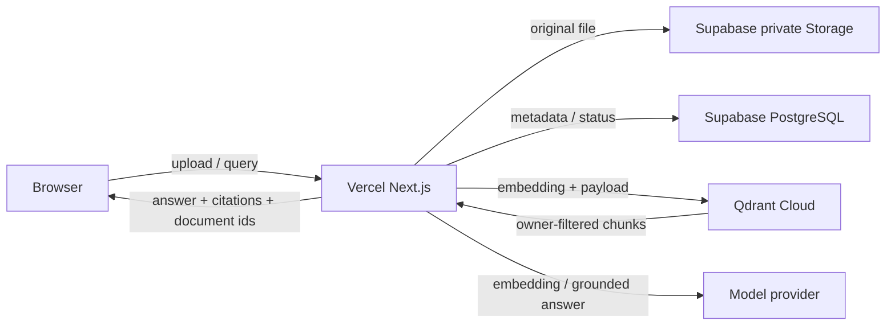

# Sageum RAG Architecture

## 제품 목표

- 사용자가 MD, HTML, TXT, PDF, DOCX, XLSX 파일을 올린다.
- 시스템은 문서의 제목·페이지·시트·셀 범위 같은 구조를 보존해 정규화한다.
- 정규화된 본문을 400단어 목표, 최대 500단어, 60단어 중첩으로 청킹한다.
- 질문 시 사용자 소유 문서만 벡터 검색하고 답변과 인용 청크, 원문 문서를 함께 반환한다.
- 검색 근거가 없으면 답변을 생성하지 않는다.

## 런타임 경계

- 브라우저는 Supabase publishable key만 가진다.
- 파일 파싱, 임베딩, Qdrant 접근, 관리자 저장 작업은 Next.js Node.js Route Handler에서 수행한다.
- Vercel 함수 제한을 넘는 대형 비동기 작업은 개인 데모 범위에서 제외하고 파일당 10MB로 제한한다.

## 저장 책임

### Supabase Storage

- bucket: `documents`
- public: `false`
- object path: `{owner_id}/{document_id}/{version_id}/{original_filename}`
- 다운로드는 인증된 사용자에 대한 signed URL로만 제공한다.

### Supabase PostgreSQL

- `documents`
  - `id uuid primary key`
  - `owner_id uuid references auth.users`
  - `title text`, `source_type text`, `latest_version_id uuid`
  - `created_at`, `updated_at`
- `document_versions`
  - `id uuid primary key`, `document_id uuid`, `owner_id uuid`
  - `storage_path text`, `mime_type text`, `size_bytes bigint`
  - `status text`: `uploaded | parsing | indexing | ready | failed`
  - `content_hash text`, `error_message text`, `created_at`
- `document_chunks`
  - `id text primary key`, `document_id uuid`, `version_id uuid`, `owner_id uuid`
  - `ordinal integer`, `word_count integer`, `heading_path text[]`
  - `page integer`, `sheet text`, `cell_range text`
  - `text text`, `created_at`

- 모든 public 테이블에 RLS를 활성화한다.
- select, insert, update, delete 정책은 모두 `owner_id = auth.uid()`를 강제한다.
- 새 테이블은 `anon`, `authenticated` 역할에 필요한 권한을 명시적으로 grant한다.
- secret key는 서버 전용이며 브라우저 코드에 포함하지 않는다.

### Qdrant

- collection: `document_chunks`
- distance: cosine
- vector size: 선택한 임베딩 모델의 차원과 동일
- point id: 청크 ID를 입력으로 만든 결정적 UUID
- payload:
  - `owner_id`, `document_id`, `version_id`, `chunk_id`
  - `source_type`, `ordinal`, `text`, `heading_path`
  - `page`, `sheet`, `cell_range`
- payload index:
  - UUID: `owner_id`, `document_id`, `version_id`
  - keyword: `source_type`
- 모든 query는 `owner_id` must-filter를 포함한다.
- strict mode에서 필터가 거부되지 않도록 컬렉션 사용 전에 payload index를 생성한다.

## 수집 파이프라인

1. 인증과 파일 크기·확장자·MIME를 검증한다.
2. 원본을 private Storage에 업로드하고 `uploaded` 버전을 만든다.
3. 형식별 파서로 `NormalizedDocument`와 위치 정보를 가진 block을 만든다.
4. block 경계를 우선해 단어 수 기준 청크를 만든다.
5. 청크를 배치 임베딩한다.
6. Qdrant 컬렉션·payload index를 확인하고 point를 upsert한다.
7. PostgreSQL 청크 메타데이터를 저장하고 버전을 `ready`로 전환한다.
8. 중간 실패 시 버전을 `failed`로 표시하고 기존 ready 버전은 검색 가능 상태로 유지한다.

## 검색·답변 계약

- 입력: `query`, 선택적 `document_ids`, `top_k`
- 검색:
  - 질문 임베딩
  - `owner_id`와 선택 문서 필터를 적용한 Qdrant query
  - 개인 데모 기본 `top_k = 8`
- 답변 모델 입력:
  - 사용자 질문
  - 점수순 청크 텍스트
  - 문서명, 제목 경로, 페이지·시트 위치
  - 근거가 없으면 답변을 거부하라는 시스템 규칙
- 출력:
  - `answer`
  - `citations[]`: `document_id`, `version_id`, `chunk_id`, 위치, score
  - `documents[]`: 제목, 원본 파일명, 다운로드용 식별자

## 무료 개인 데모 제약

- 파일당 10MB, 한 요청당 소수 파일로 제한한다.
- 동시 처리와 임베딩 배치 크기를 작게 유지한다.
- Vercel 함수에서 장시간 queue worker를 운영하지 않는다.
- 무료 한도를 넘으면 새 업로드를 거부하되 기존 검색은 유지한다.
- Qdrant MCP는 컬렉션 운영 확인에 사용할 수 있지만, 앱 런타임은 공식 JS SDK를 사용한다.

## 구현 순서

- 완료: 새 UI, MD/HTML/TXT 정규화, 단어 청킹, 로컬 검색·출처 흐름
- 완료: Supabase/Qdrant 서버 어댑터와 환경 계약
- 완료: Supabase 문서·버전·청크 마이그레이션, RLS, private Storage bucket
- 다음: Supabase Auth와 실제 업로드·메타데이터 영속화 API
- 다음: PDF/DOCX/XLSX 파서와 임베딩 공급자
- 다음: Qdrant 색인·검색, 근거 기반 LLM 스트리밍
- 마지막: Vercel·Supabase·Qdrant Cloud 연결과 브라우저 E2E
