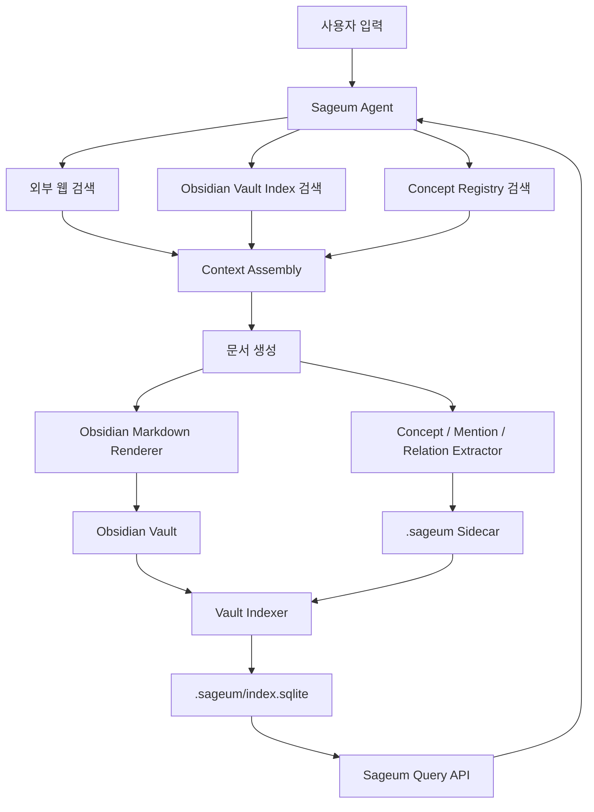
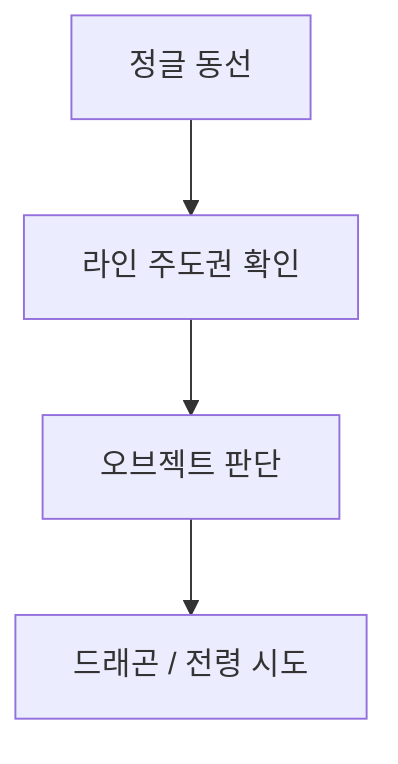
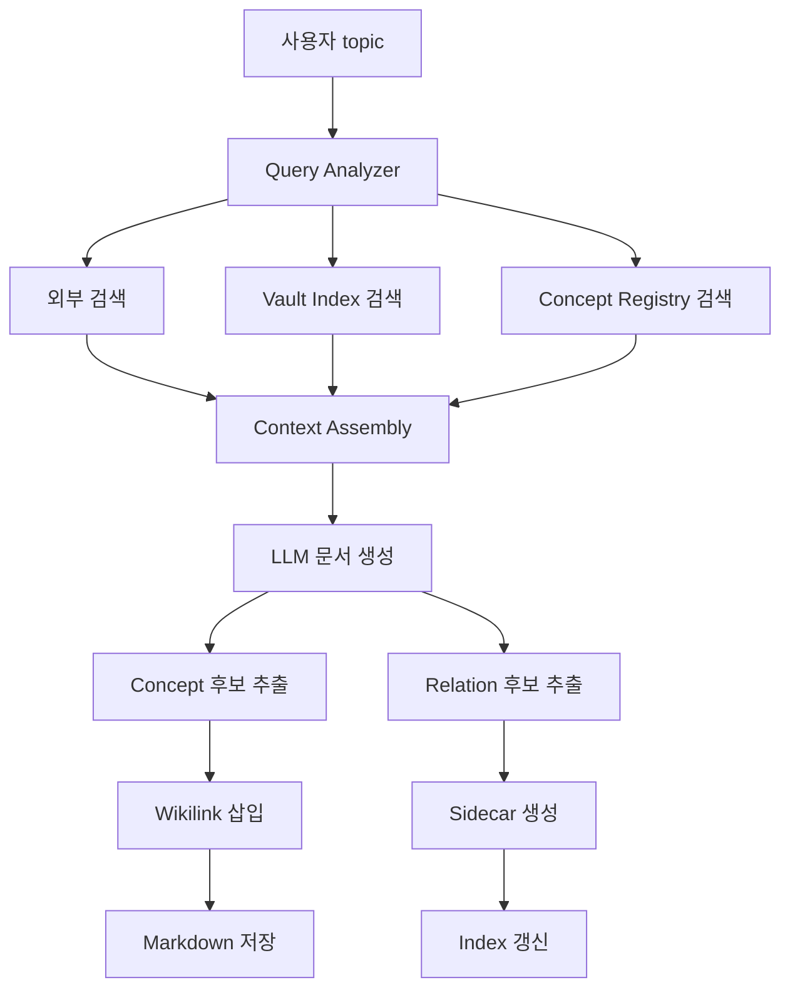
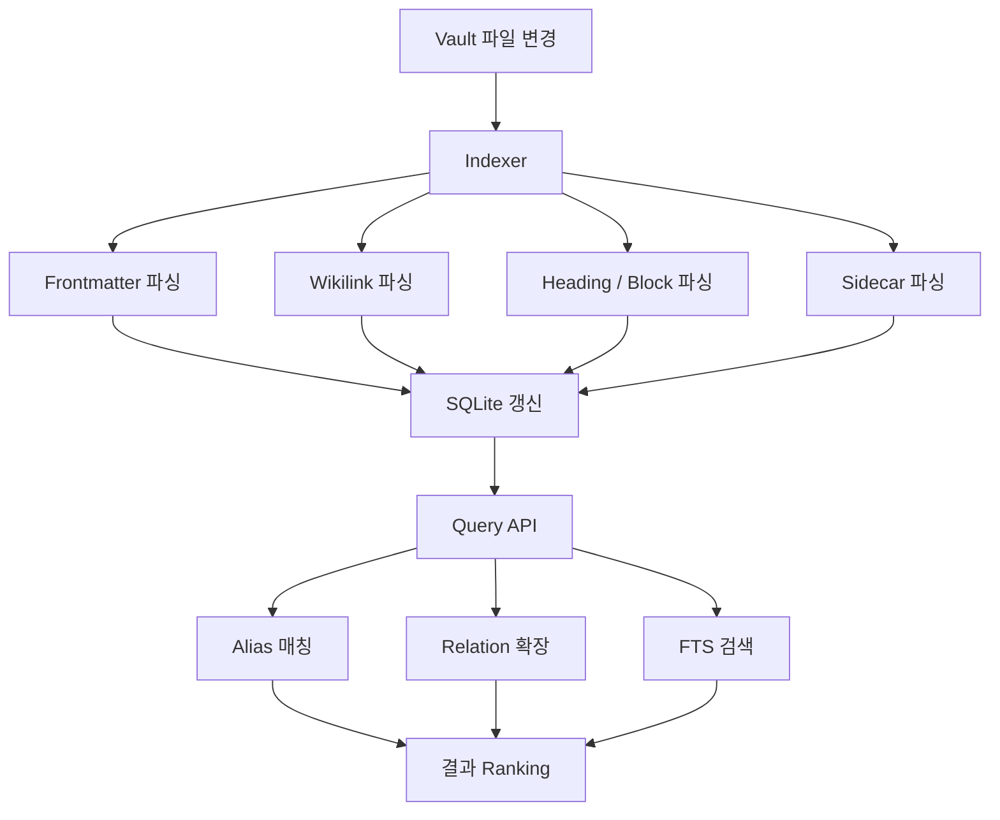

# Obsidian 기반 Sageum Semantic Document System 계획서

## 1. 목표

- Sageum을 Obsidian Vault와 연결되는 **문서 생성, 문서 보관, 문서 쿼리 최적화 시스템**으로 확장한다.
- Obsidian은 사람이 읽고 편집하는 문서 표면으로 사용한다.
- Sageum은 검색, 생성, 링크 삽입, 개념 정규화, 관계 추출, 인덱싱, 쿼리 확장을 담당한다.
- Markdown은 최종 저장 표면으로 사용하되, 기계가 사용하는 semantic 정보는 `.sageum/` sidecar와 SQLite index에 별도로 저장한다.
- 초기 버전은 임베딩 없이 `wikilink`, alias, relation, full-text index 기반으로 구현한다.
- 이후 필요 시 section/block/concept/relation evidence 단위 임베딩을 추가한다.

## 2. 핵심 판단

- Obsidian 자체만으로는 Sageum이 원하는 수준의 typed relation, evidence span, 생성 시점 graph transaction을 안정적으로 처리하기 어렵다.
- 따라서 Obsidian Vault를 Sageum의 canonical UI 겸 Markdown 저장소로 사용하고, Sageum은 별도 인덱스를 유지한다.
- Sageum이 생성한 Markdown은 Obsidian에서 자연스럽게 열려야 한다.
- Sageum이 저장한 `.sageum` 데이터는 Obsidian 플러그인 없이도 Sageum 백엔드가 읽고 검색할 수 있어야 한다.
- Obsidian 플러그인은 마지막 단계에서 붙인다.

## 3. 전체 구조



## 4. 역할 분리

### 4.1 Sageum Agent

- 사용자 topic을 받아 검색과 문서 생성을 수행한다.
- 생성 결과를 Obsidian Markdown 형식으로 렌더링한다.
- 핵심 concept 후보, mention 후보, relation 후보를 생성한다.
- Obsidian용 `[[wikilink]]`를 삽입한다.
- callback payload에 Markdown, HTML, semantic metadata를 함께 전달한다.

### 4.2 Sageum Back

- Obsidian Vault 경로를 설정으로 관리한다.
- 생성 결과를 Vault에 파일로 저장한다.
- concept note 자동 생성 여부를 결정한다.
- `.sageum/index.sqlite`를 생성하고 갱신한다.
- Vault query API를 제공한다.
- 파일 충돌, 이름 중복, slug, 경로 정규화를 처리한다.

### 4.3 Sageum Front

- 생성 결과를 미리보기로 보여준다.
- "Obsidian Vault에 저장" 동작을 제공한다.
- 저장될 문서 경로, concept note 생성 여부, relation 후보를 보여준다.
- 나중에는 Obsidian UI와 겹치는 기능을 줄이고 Sageum 고유 기능에 집중한다.

### 4.4 Obsidian

- Markdown 문서를 읽고 편집하는 클라이언트다.
- `[[wikilink]]`, backlinks, graph, search, properties를 사용한다.
- Sageum이 만든 문서를 사용자가 수정할 수 있게 한다.
- 초기에는 별도 플러그인 없이 동작해야 한다.

## 5. Vault 폴더 구조

```txt
Sageum Vault/
  00_Inbox/
    임시 생성 문서.md

  10_Notes/
    리그오브레전드 정글 잘하는 방법.md

  20_Concepts/
    정글 동선.md
    라인 주도권.md
    오브젝트 운영.md
    시야 장악.md
    상대 정글 추적.md

  30_Sources/
    riot-patch-notes-2026-07-01.md
    source-lol-jungle-guide-001.md

  40_Maps/
    리그오브레전드 정글 지식맵.md

  90_Templates/
    concept-template.md
    note-template.md

  .sageum/
    manifest.json
    index.sqlite
    annotations/
      doc_lol_jungle_guide.json
    relations/
      doc_lol_jungle_guide.json
    sources/
      source_lol_jungle_guide_001.json
```

## 6. 파일 명명 규칙

- 문서 파일명은 사용자가 읽기 쉬운 한국어 제목을 기본으로 한다.
- 같은 제목이 이미 있으면 suffix를 붙인다.
  - `리그오브레전드 정글 잘하는 방법.md`
  - `리그오브레전드 정글 잘하는 방법 2.md`
- 내부 ID는 파일명에 의존하지 않는다.
- 모든 문서는 frontmatter에 `sageum_id`를 가진다.
- 파일 이동이나 이름 변경이 일어나도 `sageum_id`로 추적한다.
- 파일명에 사용할 수 없는 문자는 제거하거나 공백으로 치환한다.
- macOS 한글 정규화 문제를 줄이기 위해 내부 인덱스에는 원본 path와 normalized path를 함께 저장한다.

## 7. Obsidian Markdown 규격

### 7.1 Note frontmatter

```md
---
sageum_id: doc_lol_jungle_guide
type: guide
domain: league-of-legends
status: generated
created_by: sageum-agent
created_at: 2026-07-01T13:00:00+09:00
updated_at: 2026-07-01T13:00:00+09:00
source_topic: 리그오브레전드 정글 잘하는 방법
aliases:
  - LoL 정글 가이드
  - 정글 잘하는 법
concepts:
  - "[[정글 동선]]"
  - "[[라인 주도권]]"
  - "[[오브젝트 운영]]"
  - "[[시야 장악]]"
tags:
  - sageum/generated
  - game/league-of-legends
---
```

### 7.2 Concept frontmatter

```md
---
sageum_id: concept_lane_priority
type: concept
status: active
created_by: sageum-agent
aliases:
  - 라인 프리오
  - 선푸쉬
  - lane priority
concept_type: game_macro
tags:
  - sageum/concept
  - game/league-of-legends
---
```

### 7.3 문서 본문 규칙

- 제목은 H1 하나만 둔다.
- 핵심 concept은 `[[개념명]]`으로 링크한다.
- 모든 단어를 링크하지 않는다.
- 사용자 독해를 방해하지 않는 수준으로 의미 있는 mention만 링크한다.
- 참고 자료는 하단 `## 참고 링크`에 둔다.
- Mermaid는 Obsidian이 렌더링할 수 있도록 fenced code block으로 둔다.

```md
# 리그오브레전드 정글 잘하는 방법

정글을 잘하려면 단순히 캠프를 빠르게 먹는 것보다 [[정글 동선]], [[라인 주도권]], [[오브젝트 운영]]을 함께 판단해야 한다.

## 핵심 판단

드래곤은 정글러 혼자 먹는 것이 아니라 [[라인 주도권]]과 [[시야 장악]]이 먼저 만들어낸 결과다.

## 구조도


```

## 8. `.sageum` Sidecar 규격

### 8.1 manifest.json

```json
{
  "version": 1,
  "vault_name": "Sageum Vault",
  "created_by": "sageum-agent",
  "created_at": "2026-07-01T13:00:00+09:00",
  "index_schema_version": 1,
  "note_roots": ["10_Notes"],
  "concept_roots": ["20_Concepts"],
  "source_roots": ["30_Sources"],
  "map_roots": ["40_Maps"]
}
```

### 8.2 annotation sidecar

```json
{
  "document_id": "doc_lol_jungle_guide",
  "file": "10_Notes/리그오브레전드 정글 잘하는 방법.md",
  "content_hash": "sha256:...",
  "mentions": [
    {
      "mention_id": "men_001",
      "text": "라인 주도권",
      "concept_id": "concept_lane_priority",
      "link_text": "[[라인 주도권]]",
      "locator": {
        "heading": "핵심 판단",
        "paragraph_index": 0,
        "start": 22,
        "end": 28
      },
      "confidence": 0.91,
      "created_by": "sageum-agent"
    }
  ]
}
```

### 8.3 relation sidecar

```json
{
  "document_id": "doc_lol_jungle_guide",
  "relations": [
    {
      "relation_id": "rel_001",
      "source_concept_id": "concept_lane_priority",
      "relation_type": "enables",
      "target_concept_id": "concept_objective_control",
      "evidence_text": "드래곤은 정글러 혼자 먹는 것이 아니라 라인 주도권과 시야 장악이 먼저 만들어낸 결과다.",
      "evidence_locator": {
        "heading": "핵심 판단",
        "paragraph_index": 0
      },
      "confidence": 0.82,
      "status": "candidate",
      "created_by": "sageum-agent"
    }
  ]
}
```

## 9. Index SQLite 설계

### 9.1 documents

```sql
CREATE TABLE documents (
  id TEXT PRIMARY KEY,
  path TEXT NOT NULL UNIQUE,
  normalized_path TEXT NOT NULL,
  title TEXT NOT NULL,
  type TEXT NOT NULL,
  status TEXT NOT NULL,
  content_hash TEXT NOT NULL,
  frontmatter_json TEXT NOT NULL,
  created_at TEXT,
  updated_at TEXT,
  indexed_at TEXT NOT NULL
);
```

### 9.2 concepts

```sql
CREATE TABLE concepts (
  id TEXT PRIMARY KEY,
  path TEXT,
  name TEXT NOT NULL,
  type TEXT,
  status TEXT NOT NULL,
  aliases_json TEXT NOT NULL,
  definition TEXT,
  created_at TEXT,
  updated_at TEXT,
  indexed_at TEXT NOT NULL
);
```

### 9.3 document_blocks

```sql
CREATE TABLE document_blocks (
  id TEXT PRIMARY KEY,
  document_id TEXT NOT NULL,
  heading_path TEXT NOT NULL,
  block_index INTEGER NOT NULL,
  block_type TEXT NOT NULL,
  text TEXT NOT NULL,
  text_hash TEXT NOT NULL,
  FOREIGN KEY (document_id) REFERENCES documents(id)
);
```

### 9.4 wikilinks

```sql
CREATE TABLE wikilinks (
  id TEXT PRIMARY KEY,
  source_document_id TEXT NOT NULL,
  source_block_id TEXT,
  target_title TEXT NOT NULL,
  target_document_id TEXT,
  link_text TEXT NOT NULL,
  context_text TEXT,
  FOREIGN KEY (source_document_id) REFERENCES documents(id)
);
```

### 9.5 mentions

```sql
CREATE TABLE mentions (
  id TEXT PRIMARY KEY,
  document_id TEXT NOT NULL,
  block_id TEXT,
  concept_id TEXT,
  text TEXT NOT NULL,
  start_offset INTEGER,
  end_offset INTEGER,
  confidence REAL,
  created_by TEXT NOT NULL,
  FOREIGN KEY (document_id) REFERENCES documents(id)
);
```

### 9.6 relations

```sql
CREATE TABLE relations (
  id TEXT PRIMARY KEY,
  source_concept_id TEXT NOT NULL,
  relation_type TEXT NOT NULL,
  target_concept_id TEXT NOT NULL,
  evidence_document_id TEXT,
  evidence_block_id TEXT,
  evidence_text TEXT,
  confidence REAL,
  status TEXT NOT NULL,
  created_by TEXT NOT NULL,
  created_at TEXT NOT NULL
);
```

### 9.7 aliases

```sql
CREATE TABLE aliases (
  id TEXT PRIMARY KEY,
  concept_id TEXT NOT NULL,
  alias TEXT NOT NULL,
  normalized_alias TEXT NOT NULL,
  source TEXT NOT NULL,
  UNIQUE (concept_id, normalized_alias),
  FOREIGN KEY (concept_id) REFERENCES concepts(id)
);
```

### 9.8 search_index

```sql
CREATE VIRTUAL TABLE search_index USING fts5(
  owner_type,
  owner_id,
  title,
  body,
  aliases,
  tokenize = 'unicode61'
);
```

## 10. 생성 라인



### 10.1 Query Analyzer 절차

1. 사용자의 원문 topic을 받는다.
2. 도메인, 의도, 난이도, 최신성 필요 여부를 판별한다.
3. 기존 concept alias와 대조한다.
4. 검색용 질의를 여러 개로 분해한다.
5. 외부 검색 질의와 Vault 검색 질의를 분리한다.

예시:

```json
{
  "raw_topic": "리그오브레전드 정글 잘하는 방법",
  "domain": "league-of-legends",
  "intent": "how-to-guide",
  "freshness_required": true,
  "vault_queries": [
    "정글 동선",
    "라인 주도권",
    "오브젝트 운영",
    "시야 장악"
  ],
  "web_queries": [
    "리그오브레전드 정글 동선 최신",
    "LoL jungle pathing guide current patch",
    "리그오브레전드 정글 오브젝트 운영"
  ]
}
```

### 10.2 Context Assembly 절차

1. 외부 검색 결과에서 제목, URL, snippet, 본문 추출 결과를 모은다.
2. Vault 검색 결과에서 관련 note, concept, section, block을 모은다.
3. 같은 concept에 대한 중복 context를 병합한다.
4. 출처가 불분명한 내용은 생성 프롬프트에서 낮은 신뢰도로 표시한다.
5. 생성 모델에게 다음 출력을 요구한다.
   - Obsidian Markdown 본문
   - concept 후보
   - relation 후보
   - 참고 링크
   - 신규 concept note 후보

### 10.3 Markdown 렌더링 절차

1. 생성된 section 구조를 검증한다.
2. 핵심 concept 후보를 canonical concept과 매칭한다.
3. 매칭된 concept은 `[[개념명]]` 링크로 삽입한다.
4. 신규 concept 후보는 `20_Concepts/`에 concept note 후보로 저장한다.
5. frontmatter를 생성한다.
6. 본문 끝에 참고 링크를 추가한다.
7. Mermaid diagram이 있으면 Obsidian compatible fenced block으로 저장한다.
8. 파일 저장 전 Markdown lint 수준의 기본 검증을 수행한다.

## 11. 보관 및 쿼리 라인



### 11.1 Indexer 절차

1. Vault root를 확인한다.
2. `.sageum/manifest.json`이 없으면 생성한다.
3. Markdown 파일 목록을 수집한다.
4. `.obsidian`, `.trash`, `.sageum` 내부 Markdown은 기본적으로 제외한다.
5. 각 파일의 content hash를 계산한다.
6. 기존 index의 hash와 같으면 skip한다.
7. 변경된 파일만 parsing한다.
8. YAML frontmatter를 추출한다.
9. heading 구조를 추출한다.
10. paragraph/list/table/code block 단위로 block을 만든다.
11. wikilink를 추출한다.
12. concept note이면 concept registry를 갱신한다.
13. note이면 document registry를 갱신한다.
14. sidecar annotation과 relation을 병합한다.
15. FTS index를 갱신한다.
16. orphan wikilink와 unresolved concept을 별도 목록에 저장한다.

### 11.2 Query API 절차

1. 사용자 query를 입력받는다.
2. normalize를 수행한다.
   - trim
   - lowercase
   - 한글 공백 정리
   - 특수문자 일부 제거
3. alias table에서 직접 매칭한다.
4. concept name에서 부분 매칭한다.
5. relation table을 따라 1-hop 또는 2-hop 확장한다.
6. 확장된 query term으로 FTS를 수행한다.
7. concept hit, relation hit, exact keyword hit를 합산해 ranking한다.
8. 결과는 document, section, block, concept 단위로 반환한다.

예시:

```txt
입력:
용 언제 먹어야 해?

정규화:
용

alias 매칭:
용 -> 드래곤

relation 확장:
드래곤 -> 오브젝트 운영
오브젝트 운영 -> 라인 주도권
오브젝트 운영 -> 시야 장악
오브젝트 운영 -> 상대 정글 위치

검색어:
용 OR 드래곤 OR 오브젝트 운영 OR 라인 주도권 OR 시야 장악 OR 상대 정글 위치
```

## 12. API 설계

### 12.1 Backend 환경 변수

```txt
SAGEUM_OBSIDIAN_VAULT_PATH=/Users/nes0903/Documents/reference/sageum-agent
SAGEUM_OBSIDIAN_NOTE_ROOT=10_Notes
SAGEUM_OBSIDIAN_CONCEPT_ROOT=20_Concepts
SAGEUM_OBSIDIAN_SOURCE_ROOT=30_Sources
SAGEUM_OBSIDIAN_MAP_ROOT=40_Maps
SAGEUM_INDEX_PATH=.sageum/index.sqlite
```

### 12.2 저장 API

```http
POST /vault/documents
```

Request:

```json
{
  "jobId": "job_123",
  "title": "리그오브레전드 정글 잘하는 방법",
  "markdown": "...",
  "concepts": [],
  "relations": [],
  "sources": [],
  "options": {
    "createConceptNotes": true,
    "overwrite": false,
    "targetFolder": "10_Notes"
  }
}
```

Response:

```json
{
  "documentId": "doc_lol_jungle_guide",
  "path": "10_Notes/리그오브레전드 정글 잘하는 방법.md",
  "createdConcepts": [
    "20_Concepts/라인 주도권.md"
  ],
  "sidecars": [
    ".sageum/annotations/doc_lol_jungle_guide.json",
    ".sageum/relations/doc_lol_jungle_guide.json"
  ]
}
```

### 12.3 인덱싱 API

```http
POST /vault/index
GET /vault/index/status
```

### 12.4 검색 API

```http
GET /vault/search?q=용%20언제%20먹어야%20해
```

Response:

```json
{
  "query": "용 언제 먹어야 해",
  "matchedConcepts": [
    {
      "id": "concept_dragon",
      "name": "드래곤",
      "matchedBy": "alias",
      "alias": "용"
    }
  ],
  "expandedConcepts": [
    "드래곤",
    "오브젝트 운영",
    "라인 주도권",
    "시야 장악"
  ],
  "results": [
    {
      "type": "block",
      "documentTitle": "리그오브레전드 정글 잘하는 방법",
      "path": "10_Notes/리그오브레전드 정글 잘하는 방법.md",
      "heading": "핵심 판단",
      "snippet": "드래곤은 정글러 혼자 먹는 것이 아니라 라인 주도권과 시야 장악이 먼저 만들어낸 결과다.",
      "score": 0.94
    }
  ]
}
```

## 13. 코드 변경 계획

### 13.1 `sageum_agent/contracts.py`

- 생성 결과 schema에 Obsidian metadata를 추가한다.
- 추가할 필드:
  - `obsidian_frontmatter`
  - `concepts`
  - `mentions`
  - `relations`
  - `source_links`
  - `suggested_filename`
- 기존 API와 호환되도록 optional 필드로 시작한다.

작업 절차:

1. 현재 curriculum/result dataclass 또는 TypedDict 구조를 확인한다.
2. optional field를 추가한다.
3. JSON serialization 테스트를 추가한다.
4. 기존 result payload가 깨지지 않는지 확인한다.

### 13.2 `sageum_agent/curriculum.py`

- 생성 프롬프트가 Obsidian용 결과를 만들도록 확장한다.
- LLM에게 다음 구조를 요구한다.
  - `title`
  - `summary`
  - `sections`
  - `concepts`
  - `mentions`
  - `relations`
  - `sources`
  - `obsidian_aliases`
  - `obsidian_tags`

작업 절차:

1. 기존 study-note skill loading 흐름을 유지한다.
2. Obsidian output contract를 프롬프트에 추가한다.
3. concept 후보는 반드시 `name`, `aliases`, `type`, `definition`을 갖게 한다.
4. relation 후보는 반드시 `source`, `relation_type`, `target`, `evidence_text`, `confidence`를 갖게 한다.
5. `_normalize_curriculum`에서 누락 필드를 빈 배열로 보정한다.

### 13.3 `sageum_agent/rendering.py`

- 기존 Markdown renderer에 Obsidian mode를 추가한다.
- 일반 Markdown과 Obsidian Markdown을 분리한다.
- 핵심 함수 후보:
  - `render_markdown`
  - `render_html`
  - `render_obsidian_markdown`
  - `render_obsidian_frontmatter`
  - `insert_wikilinks`

작업 절차:

1. concept list를 받아 canonical title map을 만든다.
2. section content에서 concept mention을 찾아 `[[title]]`로 감싼다.
3. 이미 링크된 문자열은 중복 링크하지 않는다.
4. code block 내부는 링크 삽입 대상에서 제외한다.
5. frontmatter를 YAML 문자열로 렌더링한다.
6. 참고 링크와 Mermaid block을 Obsidian 호환으로 유지한다.

### 13.4 `sageum_agent/cli.py`

- CLI에 Obsidian 렌더링 옵션을 추가한다.

예시:

```bash
sageum-agent run-job job.json --format obsidian
sageum-agent render curriculum.json --format obsidian
```

작업 절차:

1. render command의 format option을 확인한다.
2. `obsidian` format을 추가한다.
3. stdout 결과에 frontmatter 포함 Markdown이 출력되게 한다.
4. 로컬 smoke test를 추가한다.

### 13.5 `sageum-back/src/agent`

- job 완료 후 Obsidian 저장 버튼을 위해 markdown과 semantic metadata를 보관한다.
- 기존 job entity에 필요한 필드가 없으면 migration이 필요하다.
- 우선 JSON column 또는 text column으로 저장한다.

작업 절차:

1. `agent-job.entity.ts`를 확인한다.
2. `semanticMetadata` 또는 유사 필드를 추가한다.
3. callback 처리에서 agent result의 concepts/relations를 저장한다.
4. 기존 job 조회 API 응답에 metadata를 포함한다.

### 13.6 `sageum-back/src/vault`

- 신규 module을 추가한다.

파일 후보:

```txt
sageum-back/src/vault/vault.module.ts
sageum-back/src/vault/vault.controller.ts
sageum-back/src/vault/vault.service.ts
sageum-back/src/vault/vault-indexer.service.ts
sageum-back/src/vault/vault-path.service.ts
sageum-back/src/vault/vault-search.service.ts
sageum-back/src/vault/dto/save-document.dto.ts
sageum-back/src/vault/dto/search-vault.dto.ts
```

작업 절차:

1. Vault root 설정을 env에서 읽는다.
2. root가 존재하지 않으면 안전하게 에러를 반환한다.
3. root 밖으로 나가는 path traversal을 차단한다.
4. Markdown 파일 저장 함수를 만든다.
5. concept note 생성 함수를 만든다.
6. `.sageum` 폴더와 manifest 생성 함수를 만든다.
7. index.sqlite 초기화 함수를 만든다.
8. index refresh 함수를 만든다.
9. query expansion 함수를 만든다.

### 13.7 `sageum-front/src/components/sageum-app.tsx`

- job 완료 화면에 Obsidian 저장 흐름을 추가한다.
- 버튼:
  - `Obsidian에 저장`
  - `Concept 후보 보기`
  - `Relation 후보 보기`
  - `Vault에서 검색`

작업 절차:

1. 현재 job result 표시 구조를 확인한다.
2. API client에 `saveToVault`, `searchVault`, `indexVault` 함수를 추가한다.
3. 저장 버튼 클릭 시 backend 저장 API를 호출한다.
4. 저장 성공 시 파일 경로와 생성된 concept note 목록을 보여준다.
5. 저장 실패 시 경로 충돌, 권한 오류, validation 오류를 구분해 표시한다.

## 14. 단계별 구현 계획

### Phase 0. 기준선 확인

목표:

- 현재 repo 상태와 서버 실행 방식을 다시 확인한다.
- 기존 변경사항을 건드리지 않고 Obsidian 작업 범위를 분리한다.

작업:

- `git status --short` 확인
- `sageum_agent` 생성 payload 구조 확인
- `sageum-back` job 저장 구조 확인
- `sageum-front` job result UI 확인
- 현재 `.obsidian` 폴더가 이미 있는 이유 확인
- Vault root를 `sageum-agent` 루트로 쓸지 별도 폴더로 쓸지 결정

완료 기준:

- 변경 대상 파일 목록이 정리된다.
- 기존 job 생성 기능이 깨지지 않는 기준 테스트가 정리된다.

### Phase 1. Obsidian Markdown Renderer

목표:

- Sageum 생성 결과를 Obsidian 호환 Markdown으로 렌더링한다.

작업:

- frontmatter renderer 작성
- wikilink 삽입 함수 작성
- concept list normalization 작성
- relation 후보 normalization 작성
- Mermaid fence 보존 확인
- 참고 링크 섹션 렌더링 확인

테스트:

- `리그오브레전드 정글 잘하는 방법` 샘플 curriculum으로 Markdown 생성
- frontmatter가 YAML로 파싱 가능한지 확인
- wikilink가 중복 삽입되지 않는지 확인
- code block 안에는 wikilink가 들어가지 않는지 확인

완료 기준:

- `render --format obsidian`이 동작한다.
- Obsidian에서 파일을 열었을 때 properties와 wikilink가 정상 표시된다.

### Phase 2. Semantic Metadata Output

목표:

- Agent가 concept, mention, relation 후보를 구조화해 반환한다.

작업:

- curriculum schema 확장
- LLM instruction 확장
- normalization 보강
- result payload에 semantic metadata 포함

테스트:

- concept 후보가 빈 배열이어도 정상 처리
- relation 후보에 evidence_text가 없으면 제외 또는 낮은 confidence 처리
- 기존 Markdown/HTML 렌더링이 깨지지 않는지 확인

완료 기준:

- job result에 `concepts`, `mentions`, `relations`가 포함된다.
- 기존 프론트 결과 표시가 유지된다.

### Phase 3. Vault Writer

목표:

- Backend가 생성 결과를 Obsidian Vault에 저장한다.

작업:

- `vault` module 추가
- Vault root env 추가
- 안전한 path resolver 추가
- Markdown note 저장 추가
- concept note 자동 생성 추가
- sidecar annotation/relation 저장 추가
- 파일명 충돌 처리 추가

저장 절차:

1. request validation
2. title sanitize
3. target folder 확인
4. `sageum_id` 생성 또는 재사용
5. Markdown frontmatter 보정
6. note file write
7. concept note write
8. sidecar JSON write
9. index refresh trigger
10. 저장 결과 반환

완료 기준:

- 프론트 또는 curl로 job result를 Vault에 저장할 수 있다.
- `10_Notes`, `20_Concepts`, `.sageum`에 예상 파일이 생긴다.

### Phase 4. Vault Indexer

목표:

- Vault Markdown과 sidecar를 SQLite로 인덱싱한다.

작업:

- SQLite connection 관리
- schema migration 또는 recreate 전략 결정
- Markdown parser 선택
- frontmatter parser 추가
- wikilink parser 추가
- heading/block parser 추가
- sidecar parser 추가
- FTS index 추가

초기 전략:

- MVP에서는 index rebuild 방식을 사용한다.
- 파일 수가 많아지면 content hash 기반 incremental index로 바꾼다.

완료 기준:

- `POST /vault/index`로 인덱스가 생성된다.
- `GET /vault/index/status`로 문서 수, concept 수, relation 수를 확인할 수 있다.

### Phase 5. Query Expansion Search

목표:

- 임베딩 없이 concept/alias/relation 기반 검색을 제공한다.

작업:

- query normalize
- alias direct match
- concept partial match
- relation 1-hop expansion
- FTS query 생성
- 결과 ranking
- snippet 생성

Ranking 초안:

```txt
score =
  exact_title_match * 5
  + alias_match * 4
  + concept_match * 3
  + relation_neighbor_match * 2
  + full_text_match * 1
  + recency_bonus
```

완료 기준:

- `용 언제 먹어야 해?` 검색 시 `드래곤`, `오브젝트 운영`, `라인 주도권`, `시야 장악` 관련 결과가 반환된다.

### Phase 6. Frontend Save and Search UI

목표:

- 사용자가 생성 결과를 Obsidian Vault에 저장하고 Vault 검색을 테스트할 수 있다.

작업:

- API client 추가
- 저장 버튼 추가
- 저장 결과 표시
- concept 후보 패널 추가
- relation 후보 패널 추가
- Vault 검색 입력 추가
- 검색 결과 리스트 추가

완료 기준:

- 브라우저에서 생성 후 저장까지 가능하다.
- 저장 후 같은 화면에서 Vault 검색 결과를 확인할 수 있다.

### Phase 7. Relation Review Workflow

목표:

- LLM이 만든 relation 후보를 사용자가 승인/거절할 수 있게 한다.

작업:

- relation status 추가
  - `candidate`
  - `approved`
  - `rejected`
  - `stale`
- relation 승인 API 추가
- relation 거절 API 추가
- sidecar와 index 동기화
- 프론트 relation review UI 추가

완료 기준:

- 후보 relation을 승인하면 검색 확장에 더 높은 가중치로 반영된다.
- 거절한 relation은 검색 확장에서 제외된다.

### Phase 8. Obsidian Plugin

목표:

- Obsidian 내부에서 Sageum index와 relation을 볼 수 있게 한다.

작업:

- 플러그인 초기화
- Vault 내 `.sageum/index.sqlite` 읽기 방식 검토
- 현재 note의 concept sidebar 표시
- 현재 selection을 concept으로 등록
- 현재 selection을 evidence로 relation 생성
- Sageum backend와 통신

완료 기준:

- Obsidian 안에서 현재 노트의 concept, relation, evidence를 볼 수 있다.

## 15. `리그오브레전드 정글 잘하는 방법` 전체 예시

### 15.1 사용자 입력

```txt
리그오브레전드 정글 잘하는 방법
```

### 15.2 내부 query planning

```json
{
  "topic": "리그오브레전드 정글 잘하는 방법",
  "concept_queries": [
    "정글 동선",
    "갱킹",
    "오브젝트 운영",
    "라인 주도권",
    "시야 장악",
    "상대 정글 추적"
  ],
  "web_queries": [
    "리그오브레전드 정글 동선 최신",
    "LoL jungle pathing current patch",
    "정글 오브젝트 운영 라인 주도권"
  ]
}
```

### 15.3 Obsidian 출력

```md
---
sageum_id: doc_lol_jungle_guide
type: guide
domain: league-of-legends
status: generated
created_by: sageum-agent
aliases:
  - LoL 정글 가이드
  - 정글 잘하는 법
concepts:
  - "[[정글 동선]]"
  - "[[라인 주도권]]"
  - "[[오브젝트 운영]]"
  - "[[시야 장악]]"
tags:
  - sageum/generated
  - game/league-of-legends
---

# 리그오브레전드 정글 잘하는 방법

정글을 잘하려면 단순히 캠프를 빠르게 먹는 것보다 [[정글 동선]], [[라인 주도권]], [[오브젝트 운영]]을 함께 판단해야 한다.

## 핵심 판단

드래곤은 정글러 혼자 먹는 것이 아니라 [[라인 주도권]]과 [[시야 장악]]이 먼저 만들어낸 결과다.

## 복기 체크리스트

- 첫 동선 선택 이유가 있었는가?
- 첫 갱킹이 캠프 손실을 만들었는가?
- 오브젝트 전에 라인 주도권을 확인했는가?
- 상대 정글 위치를 몇 번 예측했는가?
```

### 15.4 저장되는 relation

```json
[
  {
    "source": "concept_lane_priority",
    "relation_type": "enables",
    "target": "concept_objective_control",
    "evidence_text": "드래곤은 정글러 혼자 먹는 것이 아니라 라인 주도권과 시야 장악이 먼저 만들어낸 결과다.",
    "confidence": 0.82,
    "status": "candidate"
  },
  {
    "source": "concept_vision_control",
    "relation_type": "reduces_risk_of",
    "target": "concept_objective_control",
    "evidence_text": "드래곤은 정글러 혼자 먹는 것이 아니라 라인 주도권과 시야 장악이 먼저 만들어낸 결과다.",
    "confidence": 0.79,
    "status": "candidate"
  }
]
```

### 15.5 다음 검색

```txt
용 언제 먹어야 해?
```

내부 확장:

```txt
용 -> 드래곤
드래곤 -> 오브젝트 운영
오브젝트 운영 -> 라인 주도권
오브젝트 운영 -> 시야 장악
오브젝트 운영 -> 상대 정글 위치
```

결과:

```txt
1. 리그오브레전드 정글 잘하는 방법 > 핵심 판단
2. 오브젝트 운영.md > 드래곤 판단 조건
3. 라인 주도권.md > 오브젝트와 라인 주도권
4. 시야 장악.md > 드래곤 전 시야 체크
```

## 16. 검증 계획

### 16.1 Agent 검증

- Python compile 확인
- sample curriculum render 확인
- Obsidian Markdown에 frontmatter가 포함되는지 확인
- Mermaid code fence가 유지되는지 확인
- wikilink 중복 삽입이 없는지 확인

### 16.2 Backend 검증

- TypeScript typecheck
- Vault root path traversal 차단 테스트
- Markdown 저장 테스트
- concept note 자동 생성 테스트
- sidecar JSON 생성 테스트
- index rebuild 테스트
- search API 테스트

### 16.3 Frontend 검증

- TypeScript typecheck
- 생성 결과 화면 확인
- Obsidian 저장 버튼 동작 확인
- 저장 성공/실패 상태 확인
- 검색 결과 렌더링 확인

### 16.4 Obsidian 수동 검증

- Obsidian에서 Vault 열기
- 생성된 문서 열기
- Properties 표시 확인
- wikilink 클릭 확인
- backlinks 확인
- graph view 확인
- Mermaid 렌더링 확인

## 17. 운영 규칙

- Sageum이 생성한 relation은 기본적으로 `candidate` 상태로 둔다.
- 사용자 승인 전 relation은 검색 ranking에서 낮은 가중치를 적용한다.
- 사용자가 직접 수정한 Markdown을 덮어쓰지 않는다.
- 같은 `sageum_id` 문서를 다시 저장할 때는 overwrite 옵션이 없으면 새 파일을 만든다.
- sidecar는 Markdown 파일을 보조하는 데이터이므로, Markdown이 삭제되면 orphan sidecar로 표시한다.
- index는 언제든 재생성 가능해야 한다.
- `.sageum/index.sqlite`는 canonical source가 아니라 cache다.
- canonical source는 Markdown frontmatter, sidecar JSON, concept note다.

## 18. 리스크와 대응

### 18.1 Markdown과 sidecar 불일치

- 문제:
  - 사용자가 Obsidian에서 문장을 수정하면 sidecar의 offset이 틀어질 수 있다.
- 대응:
  - offset만 믿지 않는다.
  - `evidence_text`, heading, paragraph index를 함께 저장한다.
  - indexer가 content hash 변경을 감지하면 mention locator를 stale 처리한다.

### 18.2 링크 과다

- 문제:
  - 모든 단어를 `[[link]]`로 만들면 문서가 읽기 어려워진다.
- 대응:
  - 문단당 핵심 concept 링크 수를 제한한다.
  - 같은 concept은 같은 section에서 처음 1회만 링크한다.
  - 나머지 mention은 sidecar에만 저장한다.

### 18.3 concept 중복

- 문제:
  - `드래곤`, `용`, `dragon`이 각각 다른 concept note가 될 수 있다.
- 대응:
  - concept 생성 전 alias 검색을 수행한다.
  - 중복 후보는 신규 note가 아니라 alias 후보로 저장한다.
  - concept merge workflow를 별도 단계에서 만든다.

### 18.4 Obsidian 플러그인 의존

- 문제:
  - 초기에 플러그인부터 만들면 본질보다 UI 작업이 커진다.
- 대응:
  - 플러그인 없이 Markdown과 `.sageum`만으로 먼저 동작시킨다.
  - 플러그인은 relation review와 sidebar가 필요해진 뒤 만든다.

### 18.5 임베딩 도입 시점

- 문제:
  - 초기에 임베딩까지 넣으면 구현 범위가 커진다.
- 대응:
  - 1차는 alias, wikilink, FTS, relation graph로 구현한다.
  - 검색 품질 한계가 확인되면 pgvector를 추가한다.

## 19. 임베딩 추가 시 확장 계획

- 임베딩은 1차 구현 범위에서 제외한다.
- 추가할 때는 다음 owner type별로 index를 만든다.
  - document
  - section
  - block
  - concept
  - relation evidence
- 기존 SQLite 대신 Postgres + pgvector 또는 별도 vector store를 검토한다.
- embedding table은 모델명과 차원 수를 반드시 저장한다.

```sql
CREATE TABLE embedding_index (
  id TEXT PRIMARY KEY,
  owner_type TEXT NOT NULL,
  owner_id TEXT NOT NULL,
  text_hash TEXT NOT NULL,
  embedding_model TEXT NOT NULL,
  dimensions INTEGER NOT NULL,
  vector BLOB NOT NULL,
  created_at TEXT NOT NULL
);
```

## 20. 최종 완료 기준

- 사용자가 Sageum 프론트에서 topic을 입력한다.
- Sageum Agent가 검색과 생성을 수행한다.
- 생성 결과가 Obsidian 호환 Markdown으로 만들어진다.
- 사용자가 버튼으로 Vault에 저장한다.
- `10_Notes/`에 문서가 생긴다.
- `20_Concepts/`에 필요한 concept note가 생긴다.
- `.sageum/annotations`와 `.sageum/relations`에 sidecar가 생긴다.
- `.sageum/index.sqlite`가 갱신된다.
- Vault 검색 API에서 alias와 relation 기반 query expansion이 동작한다.
- Obsidian에서 문서를 열면 wikilink, backlinks, graph가 자연스럽게 동작한다.

## 21. 추천 작업 순서 요약

1. Obsidian Markdown renderer 추가
2. Agent semantic metadata schema 추가
3. Backend Vault writer 추가
4. Concept note 자동 생성 추가
5. Sidecar JSON 저장 추가
6. SQLite indexer 추가
7. Query expansion search 추가
8. Frontend 저장 버튼 추가
9. Frontend concept/relation 후보 UI 추가
10. Relation review workflow 추가
11. Obsidian plugin 검토
12. 임베딩 검색 추가 검토
