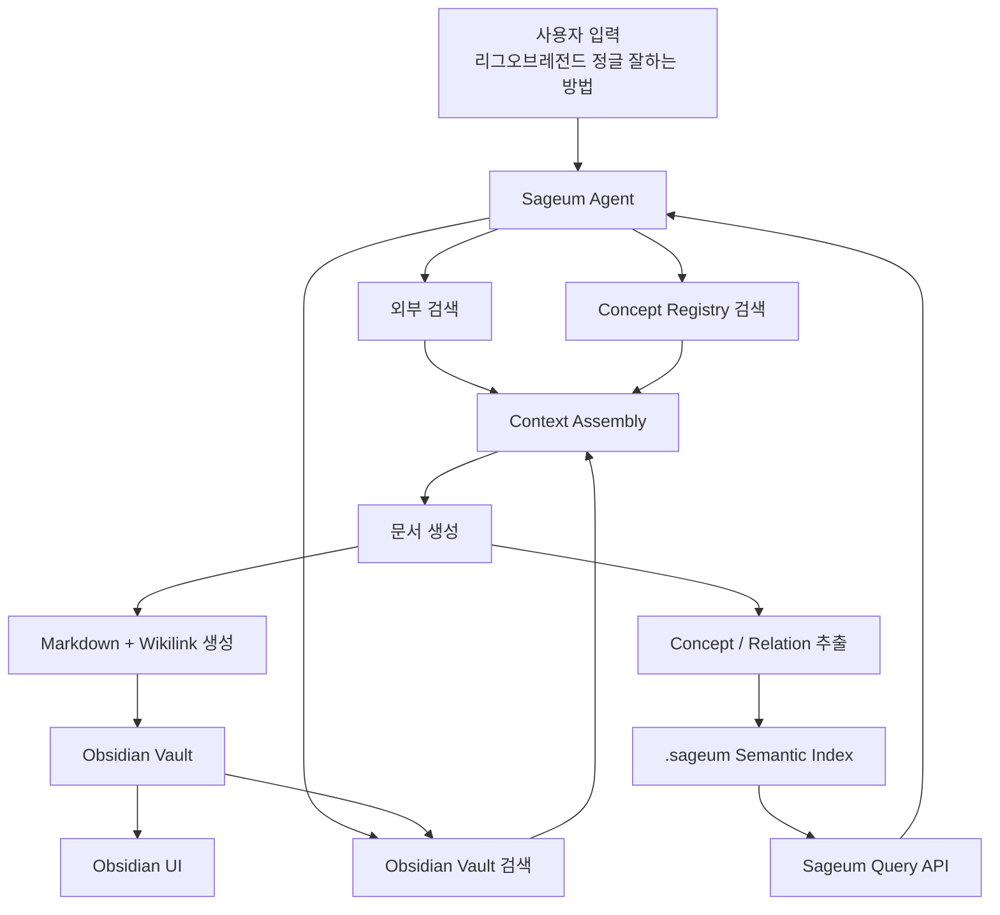

# Sageum-agent는 무슨 레포인가?

- sageum-agent는 AI를 기반으로 다수의 불특정 유저들에게 전문화된 커리큘럼을 제작하는 서비스이다.
- 커리큘럼을 제작하기 위한 정보들은 모두 웹에서 수집한다.
- 프론트, 백엔드, ai 워커 3개의 레포로 이루어진 모노 레포이다.

## 필수 기능

- 퀴즈
- 커리큘럼
- 하이퍼링크
- 시멘틱 유사도 검색
- 한눈에 보는 그래프 방식(옵시디언 방식)
- 커리큘럼 큐레이션
- 지속적 고도화
- 문서 버저닝(버저닝 별 레벨 \_ 사용자 자료 요청 레벨에 따른 차등 표현)
- 소스를 보고 다른 링크에서 검색을 진행하도록(현재 검색한 소스 제외) =>

### 구조 흐름



### vault 폴더 구조

```
Sageum Vault/
  00_Inbox/
    임시 생성 노트.md

  10_Notes/
    리그오브레전드 정글 잘하는 방법.md

  20_Concepts/
    정글 동선.md
    라인 주도권.md
    오브젝트 운영.md
    시야 장악.md
    상대 정글 추적.md

  30_Sources/
    riot-patch-notes-2026-07.md
    jungle-guide-source-001.md

  40_Maps/
    리그오브레전드 정글 지식맵.md

  .sageum/
    manifest.json
    index.sqlite
    annotations/
      doc_lol_jungle_guide.json
    relations/
      lol_jungle_relations.json
```

### 작업 절차

- 1단계
  - 목표
    - Sageum 에이전트가 검색결과를 바탕으로 Obsidian용 MarkDown을 안정적으로 생성
    - 핵심 개념에 [[wikilink]] 자동 삽입
    - concept note를 자동 생성
  - 구현 범위
    - 10_Notes 에 결과 문서 저장
    - 20_Concepts에 개념 문서 생성
    - YAML frontmatter 에 규칙 정의
    - 링크 되지 않은 개념은 concept 후보로 저장
    - Mermaid, 참고 링크, 요약 섹션 유지

- 2단계
  - 목표
    - obsidian vault를 Sageum이 검색 가능한 구조로 인덱싱

  - 처리
    - Markdown 파일 파싱
    - YAML frontmatter 추출
    - [[wikilink]] 추출
    - heading/block 단위 chunk 생성
    - alias 수집
    - backlinks 계산
    - .sageum/index.sqlite 에 저장
  - 구조도

  ```mermaid
  flowchart TD
  A["Obsidian Markdown"] --> B["Parser"]
  B --> C["Frontmatter"]
  B --> D["Wikilinks"]
  B --> E["Headings / Blocks"]
  B --> F["Tags / Aliases"]

  C --> G["SQLite Index"]
  D --> G
  E --> G
  F --> G
  ```

- 3단계 Query Line
  - 목표
    - obsidian vault를 단순 파일 검색이 아니라 concept 기반 검색으로 사용
  - 검색 흐름

  ```mermaid
  flowchart TD
  A["사용자 검색어"] --> B["Query Analyzer"]
  B --> C["Alias 매칭"]
  B --> D["Concept 매칭"]
  D --> E["Relation 확장"]
  E --> F["Vault Index 검색"]
  F --> G["관련 문서 / 문단 / 개념 반환"]
  ```

  - 예시

    ```
    용 언제 먹어야 해?
    ```

    - 내부 변환

    ```
    용 -> 드레곤 -> 오브젝트 운영
    오브젝트 운영 -> 라인 주도권, 시야 장악, 상대 정글 위치
    ```

    - 검색 대상

    ```
    [[드레곤]]
    [[오브젝트 운영]]
    [[라인 주도권]]
    [[시야 장악]]
    [[상대 정글 추적]]
    ```

- 4단계 Relation 저장
  - 목표
    - obsidian의 단순 링크 그래프를 Sageum의 typed relation 그래프로 보강
  - Sageum relation

  ```
  라인 주도권 enables 오브젝트 운영
  시야 장악 reduces_risk_of 드레곤 시도
  상대 정글 추적 improves 갱킹 판단
  ```

- 5단계 Obsidian Plugin
  - 나중에 필요해지는 단계
  - 플러그인이 담당할 것
    - Sageum index refresh 버튼
    - 현재 노트의 concept sidebar
    - relation/evidence 표시
    - 선택한 문장을 concept으로 등록
    - 선택한 문장으로 relation 생성
    - Sageum Agent에 "이 노트 확장해줘" 요청
